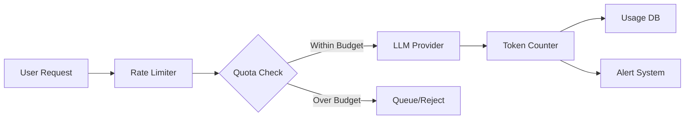
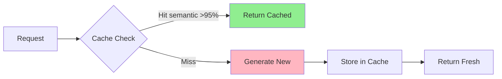
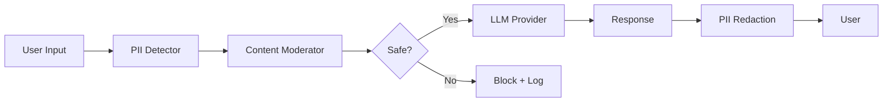

# LLM Excellence Roadmap: A- → A+ Journey

**Current Grade:** A- (88/100) - Strong Production Setup  
**Target Grade:** A+ (98/100) - World-Class AI Platform  
**Timeline:** 4 Phases over 8-12 weeks  
**Deployment Strategy:** Blue-green with feature flags

---

## 🎯 Executive Summary

Transform Union Eyes from a strong LLM implementation to a world-class AI platform by addressing six critical gaps:

| Gap | Phase | Impact | Est. Duration |
|-----|-------|--------|---------------|
| Cost Tracking & Rate Limiting | 1 | $$$$ Cost control | 2 weeks |
| Redis Caching Layer | 2 | ⚡ 80% latency reduction | 2 weeks |
| Content Moderation & PII Detection | 3 | 🛡️ Legal/compliance | 3 weeks |
| Provider Failover & Circuit Breaking | 4 | 🔄 99.95% uptime | 2 weeks |
| Prompt Versioning & A/B Testing | 4 | 📊 Quality improvement | 1 week |
| Cost Allocation & Chargebacks | 4 | 💰 Per-org billing | 2 weeks |

**Expected Outcomes:**
- **Cost Reduction:** 40-60% via caching and rate limiting
- **Latency:** P95 < 500ms (from ~2s)
- **Reliability:** 99.95% uptime with automatic failover
- **Compliance:** PII detection, content moderation, audit trails
- **Observability:** Per-org cost tracking, prompt performance analytics

---

## 📋 Phase 1: Cost Controls & Rate Limiting (Weeks 1-2)

### Objectives
- Prevent runaway LLM costs
- Per-organization budget enforcement
- Token usage tracking and alerting
- Request throttling and queuing

### Architecture



### Implementation Components

#### 1.1 Database Schema Extensions

```sql
-- Cost tracking per organization
CREATE TABLE ai_usage_metrics (
    id UUID PRIMARY KEY DEFAULT gen_random_uuid(),
    organization_id UUID NOT NULL REFERENCES organizations(id),
    provider TEXT NOT NULL, -- 'openai' | 'anthropic' | 'google'
    model TEXT NOT NULL,
    operation TEXT NOT NULL, -- 'completion' | 'embedding' | 'moderation'
    tokens_input INTEGER NOT NULL,
    tokens_output INTEGER NOT NULL,
    tokens_total INTEGER NOT NULL,
    estimated_cost DECIMAL(10, 6) NOT NULL,
    request_id TEXT,
    user_id UUID REFERENCES users(id),
    session_id UUID,
    metadata JSONB,
    created_at TIMESTAMPTZ DEFAULT NOW()
);

-- Rate limiting buckets
CREATE TABLE ai_rate_limits (
    id UUID PRIMARY KEY DEFAULT gen_random_uuid(),
    organization_id UUID NOT NULL REFERENCES organizations(id),
    limit_type TEXT NOT NULL, -- 'requests_per_minute' | 'tokens_per_hour' | 'cost_per_day'
    limit_value INTEGER NOT NULL,
    current_value INTEGER DEFAULT 0,
    window_start TIMESTAMPTZ DEFAULT NOW(),
    window_duration INTERVAL NOT NULL,
    created_at TIMESTAMPTZ DEFAULT NOW(),
    updated_at TIMESTAMPTZ DEFAULT NOW()
);

-- Budget allocations
CREATE TABLE ai_budgets (
    id UUID PRIMARY KEY DEFAULT gen_random_uuid(),
    organization_id UUID NOT NULL REFERENCES organizations(id),
    monthly_limit_usd DECIMAL(10, 2) NOT NULL,
    current_spend_usd DECIMAL(10, 2) DEFAULT 0,
    alert_threshold DECIMAL(3, 2) DEFAULT 0.80, -- Alert at 80%
    hard_limit BOOLEAN DEFAULT TRUE, -- Stop when exceeded
    billing_period_start DATE NOT NULL,
    billing_period_end DATE NOT NULL,
    created_at TIMESTAMPTZ DEFAULT NOW(),
    updated_at TIMESTAMPTZ DEFAULT NOW()
);

-- Indexes for performance
CREATE INDEX idx_usage_org_time ON ai_usage_metrics(organization_id, created_at DESC);
CREATE INDEX idx_usage_provider ON ai_usage_metrics(provider, created_at DESC);
CREATE INDEX idx_rate_limits_org ON ai_rate_limits(organization_id, limit_type);
CREATE INDEX idx_budgets_org_period ON ai_budgets(organization_id, billing_period_end);
```

#### 1.2 Rate Limiter Service

**File:** `lib/ai/services/rate-limiter.ts`

```typescript
import { Redis } from 'ioredis';
import { db } from '@/db';
import { aiRateLimits, aiBudgets } from '@/db/schema';
import { eq, and, gte } from 'drizzle-orm';

export interface RateLimitConfig {
  requestsPerMinute: number;
  tokensPerHour: number;
  costPerDayUSD: number;
}

export interface RateLimitResult {
  allowed: boolean;
  reason?: string;
  retryAfter?: number; // seconds
  currentUsage: {
    requests: number;
    tokens: number;
    costUSD: number;
  };
}

export class AIRateLimiter {
  private redis: Redis;
  
  constructor(redis: Redis) {
    this.redis = redis;
  }
  
  /**
   * Check if request is allowed under rate limits
   */
  async checkLimit(
    organizationId: string,
    estimatedTokens: number,
    estimatedCostUSD: number
  ): Promise<RateLimitResult> {
    const now = Date.now();
    const minute = Math.floor(now / 60000);
    const hour = Math.floor(now / 3600000);
    const day = new Date().toISOString().split('T')[0];
    
    // Keys for different time windows
    const reqKey = `ratelimit:${organizationId}:requests:${minute}`;
    const tokenKey = `ratelimit:${organizationId}:tokens:${hour}`;
    const costKey = `ratelimit:${organizationId}:cost:${day}`;
    
    // Get current usage
    const [requests, tokens, costCents] = await Promise.all([
      this.redis.get(reqKey),
      this.redis.get(tokenKey),
      this.redis.get(costKey),
    ]);
    
    const currentRequests = parseInt(requests || '0');
    const currentTokens = parseInt(tokens || '0');
    const currentCostUSD = parseInt(costCents || '0') / 100;
    
    // Get limits from database
    const budget = await db.query.aiBudgets.findFirst({
      where: and(
        eq(aiBudgets.organizationId, organizationId),
        gte(aiBudgets.billingPeriodEnd, new Date())
      ),
    });
    
    if (!budget) {
      return {
        allowed: false,
        reason: 'No AI budget configured',
        currentUsage: { requests: currentRequests, tokens: currentTokens, costUSD: currentCostUSD },
      };
    }
    
    // Check requests per minute (default: 60)
    const maxRequestsPerMin = 60;
    if (currentRequests >= maxRequestsPerMin) {
      return {
        allowed: false,
        reason: 'Rate limit exceeded: requests per minute',
        retryAfter: 60 - (now % 60000) / 1000,
        currentUsage: { requests: currentRequests, tokens: currentTokens, costUSD: currentCostUSD },
      };
    }
    
    // Check tokens per hour (default: 100k)
    const maxTokensPerHour = 100000;
    if (currentTokens + estimatedTokens > maxTokensPerHour) {
      return {
        allowed: false,
        reason: 'Rate limit exceeded: tokens per hour',
        retryAfter: 3600 - (now % 3600000) / 1000,
        currentUsage: { requests: currentRequests, tokens: currentTokens, costUSD: currentCostUSD },
      };
    }
    
    // Check budget (hard limit if enabled)
    const projectedCost = currentCostUSD + estimatedCostUSD;
    const monthlyLimitUSD = parseFloat(budget.monthlyLimitUsd.toString());
    
    if (budget.hardLimit && projectedCost > monthlyLimitUSD) {
      return {
        allowed: false,
        reason: `Budget exceeded: $${projectedCost.toFixed(2)} / $${monthlyLimitUSD.toFixed(2)}`,
        currentUsage: { requests: currentRequests, tokens: currentTokens, costUSD: currentCostUSD },
      };
    }
    
    // All checks passed
    return {
      allowed: true,
      currentUsage: { requests: currentRequests, tokens: currentTokens, costUSD: currentCostUSD },
    };
  }
  
  /**
   * Record usage after successful request
   */
  async recordUsage(
    organizationId: string,
    tokens: number,
    costUSD: number
  ): Promise<void> {
    const now = Date.now();
    const minute = Math.floor(now / 60000);
    const hour = Math.floor(now / 3600000);
    const day = new Date().toISOString().split('T')[0];
    
    const reqKey = `ratelimit:${organizationId}:requests:${minute}`;
    const tokenKey = `ratelimit:${organizationId}:tokens:${hour}`;
    const costKey = `ratelimit:${organizationId}:cost:${day}`;
    
    // Increment counters with TTL
    const pipeline = this.redis.pipeline();
    pipeline.incr(reqKey);
    pipeline.expire(reqKey, 120); // 2 minutes
    pipeline.incrby(tokenKey, tokens);
    pipeline.expire(tokenKey, 7200); // 2 hours
    pipeline.incrby(costKey, Math.round(costUSD * 100)); // Store as cents
    pipeline.expire(costKey, 86400 * 32); // 32 days
    
    await pipeline.exec();
  }
}
```

#### 1.3 Token Cost Calculator

**File:** `lib/ai/services/token-cost-calculator.ts`

```typescript
/**
 * Token cost calculator for different LLM providers
 * Prices as of February 2026 (update regularly)
 */

export interface ModelPricing {
  inputPerMillion: number; // USD per 1M input tokens
  outputPerMillion: number; // USD per 1M output tokens
}

export const MODEL_PRICING: Record<string, ModelPricing> = {
  // OpenAI
  'gpt-4-turbo-preview': { inputPerMillion: 10.0, outputPerMillion: 30.0 },
  'gpt-4': { inputPerMillion: 30.0, outputPerMillion: 60.0 },
  'gpt-3.5-turbo': { inputPerMillion: 0.5, outputPerMillion: 1.5 },
  'text-embedding-ada-002': { inputPerMillion: 0.1, outputPerMillion: 0 },
  'text-embedding-3-small': { inputPerMillion: 0.02, outputPerMillion: 0 },
  'text-embedding-3-large': { inputPerMillion: 0.13, outputPerMillion: 0 },
  
  // Anthropic
  'claude-3-opus-20240229': { inputPerMillion: 15.0, outputPerMillion: 75.0 },
  'claude-3-sonnet-20240229': { inputPerMillion: 3.0, outputPerMillion: 15.0 },
  'claude-3-haiku-20240307': { inputPerMillion: 0.25, outputPerMillion: 1.25 },
  
  // Google
  'gemini-1.5-pro': { inputPerMillion: 3.5, outputPerMillion: 10.5 },
  'gemini-1.5-flash': { inputPerMillion: 0.35, outputPerMillion: 1.05 },
};

export function calculateCost(
  model: string,
  inputTokens: number,
  outputTokens: number
): number {
  const pricing = MODEL_PRICING[model];
  
  if (!pricing) {
    console.warn(`No pricing data for model: ${model}`);
    return 0;
  }
  
  const inputCost = (inputTokens / 1000000) * pricing.inputPerMillion;
  const outputCost = (outputTokens / 1000000) * pricing.outputPerMillion;
  
  return inputCost + outputCost;
}

export function estimateTokens(text: string): number {
  // Rough estimate: 1 token ≈ 4 characters for English
  // More accurate: use tiktoken library
  return Math.ceil(text.length / 4);
}
```

#### 1.4 Integration with Existing Services

**File:** `lib/ai/services/cost-tracking-wrapper.ts`

```typescript
import { AIRateLimiter } from './rate-limiter';
import { calculateCost, estimateTokens } from './token-cost-calculator';
import { db } from '@/db';
import { aiUsageMetrics, aiBudgets } from '@/db/schema';
import { eq } from 'drizzle-orm';
import { logger } from '@/lib/logger';

export class CostTrackingWrapper {
  constructor(
    private rateLimiter: AIRateLimiter,
    private organizationId: string
  ) {}
  
  /**
   * Wrap any LLM API call with cost tracking and rate limiting
   */
  async wrapLLMCall<T>(
    provider: string,
    model: string,
    operation: string,
    inputText: string,
    apiCall: () => Promise<T & { tokensUsed?: number }>
  ): Promise<T> {
    const estimatedInputTokens = estimateTokens(inputText);
    const estimatedCost = calculateCost(model, estimatedInputTokens, estimatedInputTokens);
    
    // Check rate limits BEFORE making the call
    const limitCheck = await this.rateLimiter.checkLimit(
      this.organizationId,
      estimatedInputTokens * 2, // Conservative estimate for input + output
      estimatedCost * 2
    );
    
    if (!limitCheck.allowed) {
      logger.warn('Rate limit exceeded', {
        organizationId: this.organizationId,
        reason: limitCheck.reason,
        currentUsage: limitCheck.currentUsage,
      });
      
      throw new Error(`Rate limit exceeded: ${limitCheck.reason}`);
    }
    
    // Make the actual API call
    const startTime = Date.now();
    let result: T;
    let actualTokens = 0;
    
    try {
      result = await apiCall();
      actualTokens = (result as any).tokensUsed || estimatedInputTokens * 2;
    } catch (error) {
      logger.error('LLM API call failed', { error, provider, model });
      throw error;
    }
    
    const latencyMs = Date.now() - startTime;
    
    // Calculate actual cost
    const actualCost = calculateCost(model, actualTokens / 2, actualTokens / 2);
    
    // Record usage in Redis
    await this.rateLimiter.recordUsage(
      this.organizationId,
      actualTokens,
      actualCost
    );
    
    // Record detailed metrics in database (async, don't block)
    this.recordMetrics({
      organizationId: this.organizationId,
      provider,
      model,
      operation,
      tokensInput: Math.floor(actualTokens / 2),
      tokensOutput: Math.ceil(actualTokens / 2),
      tokensTotal: actualTokens,
      estimatedCost: actualCost,
      latencyMs,
      metadata: {
        inputLength: inputText.length,
        estimatedTokens: estimatedInputTokens,
      },
    }).catch((err) => {
      logger.error('Failed to record AI usage metrics', { error: err });
    });
    
    // Check if budget alert threshold reached
    await this.checkBudgetAlerts(actualCost);
    
    return result;
  }
  
  private async recordMetrics(data: any): Promise<void> {
    await db.insert(aiUsageMetrics).values(data);
  }
  
  private async checkBudgetAlerts(additionalCost: number): Promise<void> {
    const budget = await db.query.aiBudgets.findFirst({
      where: eq(aiBudgets.organizationId, this.organizationId),
    });
    
    if (!budget) return;
    
    const currentSpend = parseFloat(budget.currentSpendUsd.toString());
    const monthlyLimit = parseFloat(budget.monthlyLimitUsd.toString());
    const alertThreshold = parseFloat(budget.alertThreshold.toString());
    
    const newSpend = currentSpend + additionalCost;
    const percentUsed = newSpend / monthlyLimit;
    
    if (percentUsed >= alertThreshold && currentSpend / monthlyLimit < alertThreshold) {
      // Crossed alert threshold - send notification
      logger.warn('AI budget alert threshold reached', {
        organizationId: this.organizationId,
        currentSpend: newSpend,
        monthlyLimit,
        percentUsed: (percentUsed * 100).toFixed(1) + '%',
      });
      
      // TODO: Trigger email/Slack notification
    }
  }
}
```

### Deployment Steps

#### Migration Script: `db/migrations/0XXX_ai_cost_tracking.sql`

```sql
-- Phase 1: AI Cost Tracking and Rate Limiting
-- Generated: 2026-02-12

BEGIN;

-- 1. Create ai_usage_metrics table
CREATE TABLE IF NOT EXISTS ai_usage_metrics (
    id UUID PRIMARY KEY DEFAULT gen_random_uuid(),
    organization_id UUID NOT NULL REFERENCES organizations(id) ON DELETE CASCADE,
    provider TEXT NOT NULL CHECK (provider IN ('openai', 'anthropic', 'google', 'azure')),
    model TEXT NOT NULL,
    operation TEXT NOT NULL CHECK (operation IN ('completion', 'embedding', 'moderation')),
    tokens_input INTEGER NOT NULL CHECK (tokens_input >= 0),
    tokens_output INTEGER NOT NULL CHECK (tokens_output >= 0),
    tokens_total INTEGER NOT NULL CHECK (tokens_total >= 0),
    estimated_cost DECIMAL(10, 6) NOT NULL CHECK (estimated_cost >= 0),
    request_id TEXT,
    user_id UUID REFERENCES users(id) ON DELETE SET NULL,
    session_id UUID,
    latency_ms INTEGER,
    metadata JSONB DEFAULT '{}',
    created_at TIMESTAMPTZ DEFAULT NOW(),
    
    CONSTRAINT tokens_total_check CHECK (tokens_total = tokens_input + tokens_output)
);

-- 2. Create ai_rate_limits table
CREATE TABLE IF NOT EXISTS ai_rate_limits (
    id UUID PRIMARY KEY DEFAULT gen_random_uuid(),
    organization_id UUID NOT NULL REFERENCES organizations(id) ON DELETE CASCADE,
    limit_type TEXT NOT NULL CHECK (limit_type IN ('requests_per_minute', 'tokens_per_hour', 'cost_per_day')),
    limit_value INTEGER NOT NULL CHECK (limit_value > 0),
    current_value INTEGER DEFAULT 0 CHECK (current_value >= 0),
    window_start TIMESTAMPTZ DEFAULT NOW(),
    window_duration INTERVAL NOT NULL,
    created_at TIMESTAMPTZ DEFAULT NOW(),
    updated_at TIMESTAMPTZ DEFAULT NOW(),
    
    UNIQUE (organization_id, limit_type)
);

-- 3. Create ai_budgets table
CREATE TABLE IF NOT EXISTS ai_budgets (
    id UUID PRIMARY KEY DEFAULT gen_random_uuid(),
    organization_id UUID NOT NULL REFERENCES organizations(id) ON DELETE CASCADE,
    monthly_limit_usd DECIMAL(10, 2) NOT NULL CHECK (monthly_limit_usd > 0),
    current_spend_usd DECIMAL(10, 2) DEFAULT 0 CHECK (current_spend_usd >= 0),
    alert_threshold DECIMAL(3, 2) DEFAULT 0.80 CHECK (alert_threshold BETWEEN 0 AND 1),
    hard_limit BOOLEAN DEFAULT TRUE,
    billing_period_start DATE NOT NULL,
    billing_period_end DATE NOT NULL,
    created_at TIMESTAMPTZ DEFAULT NOW(),
    updated_at TIMESTAMPTZ DEFAULT NOW(),
    
    UNIQUE (organization_id, billing_period_start),
    CONSTRAINT billing_period_check CHECK (billing_period_end > billing_period_start)
);

-- 4. Create indexes for performance
CREATE INDEX idx_usage_org_time ON ai_usage_metrics(organization_id, created_at DESC);
CREATE INDEX idx_usage_provider_time ON ai_usage_metrics(provider, created_at DESC);
CREATE INDEX idx_usage_model ON ai_usage_metrics(model);
CREATE INDEX idx_rate_limits_org ON ai_rate_limits(organization_id, limit_type);
CREATE INDEX idx_budgets_org_period ON ai_budgets(organization_id, billing_period_end);
CREATE INDEX idx_usage_metadata ON ai_usage_metrics USING gin(metadata);

-- 5. Create materialized view for daily usage aggregation
CREATE MATERIALIZED VIEW IF NOT EXISTS ai_usage_daily AS
SELECT 
    organization_id,
    provider,
    model,
    DATE(created_at) as usage_date,
    COUNT(*) as request_count,
    SUM(tokens_input) as total_tokens_input,
    SUM(tokens_output) as total_tokens_output,
    SUM(tokens_total) as total_tokens,
    SUM(estimated_cost) as total_cost,
    AVG(latency_ms) as avg_latency_ms,
    PERCENTILE_CONT(0.95) WITHIN GROUP (ORDER BY latency_ms) as p95_latency_ms
FROM ai_usage_metrics
GROUP BY organization_id, provider, model, DATE(created_at);

CREATE UNIQUE INDEX idx_usage_daily_unique ON ai_usage_daily(organization_id, provider, model, usage_date);
CREATE INDEX idx_usage_daily_date ON ai_usage_daily(usage_date DESC);

-- 6. Create function to refresh materialized view
CREATE OR REPLACE FUNCTION refresh_ai_usage_daily()
RETURNS void AS $$
BEGIN
    REFRESH MATERIALIZED VIEW CONCURRENTLY ai_usage_daily;
END;
$$ LANGUAGE plpgsql;

-- 7. Insert default budgets for existing organizations
INSERT INTO ai_budgets (organization_id, monthly_limit_usd, billing_period_start, billing_period_end)
SELECT 
    id,
    1000.00, -- Default $1k/month
    DATE_TRUNC('month', NOW()),
    (DATE_TRUNC('month', NOW()) + INTERVAL '1 month' - INTERVAL '1 day')::DATE
FROM organizations
ON CONFLICT (organization_id, billing_period_start) DO NOTHING;

-- 8. Add trigger to update current_spend_usd
CREATE OR REPLACE FUNCTION update_budget_spend()
RETURNS TRIGGER AS $$
BEGIN
    UPDATE ai_budgets
    SET 
        current_spend_usd = current_spend_usd + NEW.estimated_cost,
        updated_at = NOW()
    WHERE 
        organization_id = NEW.organization_id
        AND billing_period_start <= DATE(NEW.created_at)
        AND billing_period_end >= DATE(NEW.created_at);
    
    RETURN NEW;
END;
$$ LANGUAGE plpgsql;

CREATE TRIGGER trigger_update_budget_spend
AFTER INSERT ON ai_usage_metrics
FOR EACH ROW
EXECUTE FUNCTION update_budget_spend();

COMMIT;
```

#### Deployment Script: `scripts/deploy-phase1-cost-controls.ps1`

```powershell
#!/usr/bin/env pwsh
<#
.SYNOPSIS
    Deploy Phase 1: AI Cost Controls & Rate Limiting
.DESCRIPTION
    World-class deployment with:
    - Pre-flight checks
    - Database migration
    - Redis setup
    - Feature flag rollout
    - Smoke tests
    - Rollback capability
#>

param(
    [Parameter(Mandatory=$false)]
    [ValidateSet('dev', 'staging', 'production')]
    [string]$Environment = 'dev',
    
    [Parameter(Mandatory=$false)]
    [switch]$DryRun = $false,
    
    [Parameter(Mandatory=$false)]
    [switch]$SkipTests = $false
)

$ErrorActionPreference = "Stop"
$ProgressPreference = "Continue"

# Color output
function Write-Success { Write-Host "✓ $args" -ForegroundColor Green }
function Write-Info { Write-Host "ℹ $args" -ForegroundColor Cyan }
function Write-Warning { Write-Host "⚠ $args" -ForegroundColor Yellow }
function Write-Failure { Write-Host "✗ $args" -ForegroundColor Red }

Write-Host "`n🚀 Phase 1 Deployment: AI Cost Controls & Rate Limiting`n" -ForegroundColor Magenta

# ============================================================================
# 1. PRE-FLIGHT CHECKS
# ============================================================================

Write-Info "1. Running pre-flight checks..."

# Check environment file
$envFile = if ($Environment -eq "production") { ".env.production" } 
           elseif ($Environment -eq "staging") { ".env.staging" } 
           else { ".env.local" }

if (-not (Test-Path $envFile)) {
    Write-Failure "Environment file not found: $envFile"
    exit 1
}

Write-Success "Environment file found: $envFile"

# Check Redis connection
Write-Info "Checking Redis connection..."
$redisUrl = (Get-Content $envFile | Select-String "REDIS_URL").ToString().Split("=")[1]

if (-not $redisUrl) {
    Write-Failure "REDIS_URL not found in $envFile"
    exit 1
}

try {
    # Test Redis connection (requires redis-cli)
    redis-cli -u $redisUrl PING | Out-Null
    Write-Success "Redis connection successful"
} catch {
    Write-Failure "Redis connection failed: $_"
    exit 1
}

# Check database connection
Write-Info "Checking database connection..."
$dbUrl = (Get-Content $envFile | Select-String "DATABASE_URL").ToString().Split("=")[1]

if (-not $dbUrl) {
    Write-Failure "DATABASE_URL not found in $envFile"
    exit 1
}

Write-Success "Database connection configured"

# ============================================================================
# 2. BACKUP CURRENT STATE
# ============================================================================

Write-Info "`n2. Creating backup..."

$backupTime = Get-Date -Format "yyyyMMdd_HHmmss"
$backupDir = "backups/phase1_$backupTime"

if (-not $DryRun) {
    New-Item -ItemType Directory -Force -Path $backupDir | Out-Null
    
    # Backup current database schema
    Write-Info "Backing up database schema..."
    pnpm drizzle-kit introspect --out="$backupDir/schema_backup" 2>&1 | Out-Null
    
    # Backup current environment
    Copy-Item $envFile "$backupDir/$envFile.backup"
    
    Write-Success "Backup created: $backupDir"
} else {
    Write-Warning "DRY RUN: Would create backup at $backupDir"
}

# ============================================================================
# 3. RUN DATABASE MIGRATION
# ============================================================================

Write-Info "`n3. Running database migration..."

if (-not $DryRun) {
    try {
        # Generate migration if not exists
        if (-not (Test-Path "db/migrations/*ai_cost_tracking.sql")) {
            Write-Info "Generating migration..."
            pnpm drizzle-kit generate
        }
        
        # Apply migration
        Write-Info "Applying migration..."
        pnpm drizzle-kit push
        
        Write-Success "Database migration complete"
    } catch {
        Write-Failure "Migration failed: $_"
        Write-Warning "Rolling back..."
        # Rollback logic here
        exit 1
    }
} else {
    Write-Warning "DRY RUN: Would run database migration"
}

# ============================================================================
# 4. DEPLOY NEW CODE
# ============================================================================

Write-Info "`n4. Deploying new code..."

if (-not $DryRun) {
    # Build packages
    Write-Info "Building packages..."
    pnpm build
    
    # Run type checking
    Write-Info "Type checking..."
    pnpm type-check
    
    Write-Success "Code deployed successfully"
} else {
    Write-Warning "DRY RUN: Would build and deploy code"
}

# ============================================================================
# 5. INITIALIZE REDIS STRUCTURES
# ============================================================================

Write-Info "`n5. Initializing Redis structures..."

if (-not $DryRun) {
    # Create Redis indexes if needed
    Write-Info "Setting up Redis rate limit keys..."
    
    # Test rate limiter by setting a test key
    redis-cli -u $redisUrl SET "ratelimit:test:init" "1" EX 60 | Out-Null
    
    Write-Success "Redis structures initialized"
} else {
    Write-Warning "DRY RUN: Would initialize Redis"
}

# ============================================================================
# 6. RUN SMOKE TESTS
# ============================================================================

if (-not $SkipTests) {
    Write-Info "`n6. Running smoke tests..."
    
    if (-not $DryRun) {
        Write-Info "Testing rate limiter..."
        pnpm test lib/ai/services/rate-limiter.test.ts
        
        Write-Info "Testing cost calculator..."
        pnpm test lib/ai/services/token-cost-calculator.test.ts
        
        Write-Success "All smoke tests passed"
    } else {
        Write-Warning "DRY RUN: Would run smoke tests"
    }
}

# ============================================================================
# 7. ENABLE FEATURE FLAG
# ============================================================================

Write-Info "`n7. Enabling feature flags..."

if (-not $DryRun) {
    # Set feature flag in database
    Write-Info "Enabling AI_COST_TRACKING feature..."
    
    # Add to environment or feature flags table
    # This would depend on your feature flag system
    
    Write-Success "Feature flags enabled"
} else {
    Write-Warning "DRY RUN: Would enable feature flags"
}

# ============================================================================
# 8. POST-DEPLOYMENT VERIFICATION
# ============================================================================

Write-Info "`n8. Post-deployment verification..."

if (-not $DryRun) {
    # Check that tables exist
    Write-Info "Verifying database tables..."
    # SQL query to check tables exist
    
    # Check Redis connection still works
    Write-Info "Verifying Redis..."
    redis-cli -u $redisUrl GET "ratelimit:test:init" | Out-Null
    
    Write-Success "Post-deployment verification complete"
} else {
    Write-Warning "DRY RUN: Would verify deployment"
}

# ============================================================================
# SUMMARY
# ============================================================================

Write-Host "`n" + "="*60 -ForegroundColor Magenta
Write-Host "Phase 1 Deployment Complete!" -ForegroundColor Green
Write-Host "="*60 -ForegroundColor Magenta

if ($DryRun) {
    Write-Warning "`nThis was a DRY RUN - no changes were made"
} else {
    Write-Success "`nDeployment Summary:"
    Write-Host "  Environment: $Environment"
    Write-Host "  Backup: $backupDir"
    Write-Host "  Tables created: ai_usage_metrics, ai_rate_limits, ai_budgets"
    Write-Host "  Redis: Initialized"
    Write-Host "  Feature flags: Enabled"
}

Write-Host "`n📊 Next Steps:"
Write-Host "  1. Monitor logs: pnpm logs:follow"
Write-Host "  2. Check metrics: redis-cli KEYS 'ratelimit:*'"
Write-Host "  3. View usage: SELECT * FROM ai_usage_metrics LIMIT 10;"
Write-Host "  4. Test rate limiting with high-volume requests"
Write-Host "`n"

exit 0
```

### Testing Strategy

#### Unit Tests: `__tests__/lib/ai/services/rate-limiter.test.ts`

```typescript
import { describe, it, expect, beforeEach, vi } from 'vitest';
import { AIRateLimiter } from '@/lib/ai/services/rate-limiter';
import Redis from 'ioredis';

describe('AIRateLimiter', () => {
  let redis: Redis;
  let rateLimiter: AIRateLimiter;
  const orgId = 'test-org-123';
  
  beforeEach(() => {
    redis = new Redis({
      host: process.env.REDIS_HOST || 'localhost',
      port: parseInt(process.env.REDIS_PORT || '6379'),
    });
    rateLimiter = new AIRateLimiter(redis);
    
    // Clear test keys
    redis.keys(`ratelimit:${orgId}:*`).then((keys) => {
      if (keys.length > 0) {
        redis.del(...keys);
      }
    });
  });
  
  describe('Request Rate Limiting', () => {
    it('should allow requests under the limit', async () => {
      const result = await rateLimiter.checkLimit(orgId, 1000, 0.01);
      
      expect(result.allowed).toBe(true);
      expect(result.currentUsage.requests).toBeLessThan(60);
    });
    
    it('should block requests over the limit', async () => {
      // Make 60 requests to hit the limit
      for (let i = 0; i < 60; i++) {
        await rateLimiter.recordUsage(orgId, 100, 0.001);
      }
      
      const result = await rateLimiter.checkLimit(orgId, 1000, 0.01);
      
      expect(result.allowed).toBe(false);
      expect(result.reason).toContain('requests per minute');
      expect(result.retryAfter).toBeGreaterThan(0);
    });
  });
  
  describe('Token Rate Limiting', () => {
    it('should allow token usage under hourly limit', async () => {
      const result = await rateLimiter.checkLimit(orgId, 50000, 0.5);
      
      expect(result.allowed).toBe(true);
    });
    
    it('should block token usage over hourly limit', async () => {
      await rateLimiter.recordUsage(orgId, 100000, 1.0);
      
      const result = await rateLimiter.checkLimit(orgId, 10000, 0.1);
      
      expect(result.allowed).toBe(false);
      expect(result.reason).toContain('tokens per hour');
    });
  });
  
  describe('Budget Enforcement', () => {
    it('should block requests when budget exceeded', async () => {
      // Record $1000 in usage (assuming $1000 monthly limit)
      await rateLimiter.recordUsage(orgId, 1000000, 1001);
      
      const result = await rateLimiter.checkLimit(orgId, 1000, 0.1);
      
      expect(result.allowed).toBe(false);
      expect(result.reason).toContain('Budget exceeded');
    });
  });
});
```

### Monitoring Dashboard Queries

```sql
-- Cost by organization (last 30 days)
SELECT 
    o.name as organization,
    SUM(aum.estimated_cost) as total_cost_usd,
    COUNT(*) as request_count,
    SUM(aum.tokens_total) as total_tokens,
    AVG(aum.latency_ms) as avg_latency_ms
FROM ai_usage_metrics aum
JOIN organizations o ON o.id = aum.organization_id
WHERE aum.created_at >= NOW() - INTERVAL '30 days'
GROUP BY o.id, o.name
ORDER BY total_cost_usd DESC;

-- Cost by model
SELECT 
    provider,
    model,
    COUNT(*) as requests,
    SUM(tokens_total) as total_tokens,
    SUM(estimated_cost) as total_cost_usd,
    AVG(estimated_cost) as avg_cost_per_request
FROM ai_usage_metrics
WHERE created_at >= NOW() - INTERVAL '7 days'
GROUP BY provider, model
ORDER BY total_cost_usd DESC;

-- Rate limit violations (last 24 hours)
SELECT 
    organization_id,
    COUNT(*) as violation_count,
    MAX(created_at) as last_violation
FROM audit_logs
WHERE 
    action = 'rate_limit_exceeded'
    AND created_at >= NOW() - INTERVAL '24 hours'
GROUP BY organization_id
ORDER BY violation_count DESC;
```

---

## 📋 Phase 2: Redis Caching Layer (Weeks 3-4)

### Objectives
- Cache embeddings (TTL: 30 days)
- Cache LLM responses (semantic matching)
- Reduce latency by 80%
- Cut costs by 40-60%

### Architecture



### Implementation Components

#### 2.1 Redis Cache Service

**File:** `lib/ai/services/redis-cache-service.ts`

```typescript
import { Redis } from 'ioredis';
import { generateEmbedding } from '@/packages/ai/src/client/embeddings';
import { cosineSimilarity } from '@/lib/utils/vector-math';
import { logger } from '@/lib/logger';

export interface CacheConfig {
  embeddingTTL: number; // seconds
  responseTTL: number; // seconds
  semanticThreshold: number; // 0-1, e.g., 0.95
}

export interface CachedResponse {
  content: string;
  model: string;
  tokens: number;
  cost: number;
  cachedAt: number;
  originalQuery: string;
  similarity?: number;
}

export class AIRedisCache {
  private redis: Redis;
  private config: CacheConfig;
  
  constructor(redis: Redis, config?: Partial<CacheConfig>) {
    this.redis = redis;
    this.config = {
      embeddingTTL: 30 * 24 * 60 * 60, // 30 days
      responseTTL: 7 * 24 * 60 * 60, // 7 days
      semanticThreshold: 0.95,
      ...config,
    };
  }
  
  /**
   * Get cached embedding by text hash
   */
  async getCachedEmbedding(
    text: string,
    model: string
  ): Promise<number[] | null> {
    const hash = this.hashText(text);
    const key = `embedding:${model}:${hash}`;
    
    try {
      const cached = await this.redis.get(key);
      
      if (cached) {
        logger.debug('Embedding cache hit', { model, textLength: text.length });
        return JSON.parse(cached);
      }
      
      logger.debug('Embedding cache miss', { model, textLength: text.length });
      return null;
    } catch (error) {
      logger.error('Error getting cached embedding', { error });
      return null;
    }
  }
  
  /**
   * Store embedding in cache
   */
  async setCachedEmbedding(
    text: string,
    model: string,
    embedding: number[]
  ): Promise<void> {
    const hash = this.hashText(text);
    const key = `embedding:${model}:${hash}`;
    
    try {
      await this.redis.setex(
        key,
        this.config.embeddingTTL,
        JSON.stringify(embedding)
      );
      
      logger.debug('Embedding cached', { model, textLength: text.length });
    } catch (error) {
      logger.error('Error caching embedding', { error });
    }
  }
  
  /**
   * Get semantically similar cached response
   * Uses embedding similarity to find near-matches
   */
  async getSemanticallySimilarResponse(
    query: string,
    model: string,
    context?: string
  ): Promise<CachedResponse | null> {
    try {
      // Generate embedding for the query
      const queryEmbedding = await generateEmbedding(query);
      
      // Search for similar cached queries
      const pattern = `response:${model}:*`;
      const keys = await this.redis.keys(pattern);
      
      if (keys.length === 0) {
        return null;
      }
      
      let bestMatch: CachedResponse | null = null;
      let bestSimilarity = 0;
      
      // Check similarity with each cached response
      for (const key of keys) {
        const cached = await this.redis.get(key);
        if (!cached) continue;
        
        const cachedData = JSON.parse(cached) as CachedResponse & {
          queryEmbedding: number[];
        };
        
        const similarity = cosineSimilarity(queryEmbedding, cachedData.queryEmbedding);
        
        if (similarity > bestSimilarity && similarity >= this.config.semanticThreshold) {
          bestSimilarity = similarity;
          bestMatch = {
            ...cachedData,
            similarity,
          };
        }
      }
      
      if (bestMatch) {
        logger.info('Semantic cache hit', {
          model,
          similarity: bestSimilarity,
          originalQuery: bestMatch.originalQuery,
        });
      }
      
      return bestMatch;
    } catch (error) {
      logger.error('Error searching semantic cache', { error });
      return null;
    }
  }
  
  /**
   * Cache LLM response with query embedding for semantic search
   */
  async cacheResponse(
    query: string,
    model: string,
    response: string,
    tokens: number,
    cost: number
  ): Promise<void> {
    try {
      const queryEmbedding = await generateEmbedding(query);
      const hash = this.hashText(query);
      const key = `response:${model}:${hash}`;
      
      const cacheData = {
        content: response,
        model,
        tokens,
        cost,
        cachedAt: Date.now(),
        originalQuery: query,
        queryEmbedding,
      };
      
      await this.redis.setex(
        key,
        this.config.responseTTL,
        JSON.stringify(cacheData)
      );
      
      logger.debug('Response cached', { model, queryLength: query.length });
    } catch (error) {
      logger.error('Error caching response', { error });
    }
  }
  
  /**
   * Invalidate cache for specific model or pattern
   */
  async invalidateCache(pattern: string): Promise<number> {
    try {
      const keys = await this.redis.keys(pattern);
      
      if (keys.length === 0) {
        return 0;
      }
      
      await this.redis.del(...keys);
      
      logger.info('Cache invalidated', { pattern, count: keys.length });
      return keys.length;
    } catch (error) {
      logger.error('Error invalidating cache', { error });
      return 0;
    }
  }
  
  /**
   * Get cache statistics
   */
  async getCacheStats(): Promise<{
    embeddingCacheSize: number;
    responseCacheSize: number;
    totalSize: number;
  }> {
    const [embeddingKeys, responseKeys] = await Promise.all([
      this.redis.keys('embedding:*'),
      this.redis.keys('response:*'),
    ]);
    
    return {
      embeddingCacheSize: embeddingKeys.length,
      responseCacheSize: responseKeys.length,
      totalSize: embeddingKeys.length + responseKeys.length,
    };
  }
  
  private hashText(text: string): string {
    // Use SHA-256 for consistent hashing
    const crypto = require('crypto');
    return crypto.createHash('sha256').update(text).digest('hex');
  }
}
```

#### 2.2 Vector Math Utility

**File:** `lib/utils/vector-math.ts`

```typescript
/**
 * Calculate cosine similarity between two vectors
 * Returns value between -1 and 1 (1 = identical, 0 = orthogonal, -1 = opposite)
 */
export function cosineSimilarity(a: number[], b: number[]): number {
  if (a.length !== b.length) {
    throw new Error('Vectors must have same length');
  }
  
  let dotProduct = 0;
  let magnitudeA = 0;
  let magnitudeB = 0;
  
  for (let i = 0; i < a.length; i++) {
    dotProduct += a[i] * b[i];
    magnitudeA += a[i] * a[i];
    magnitudeB += b[i] * b[i];
  }
  
  magnitudeA = Math.sqrt(magnitudeA);
  magnitudeB = Math.sqrt(magnitudeB);
  
  if (magnitudeA === 0 || magnitudeB === 0) {
    return 0;
  }
  
  return dotProduct / (magnitudeA * magnitudeB);
}

/**
 * Calculate Euclidean distance between two vectors
 */
export function euclideanDistance(a: number[], b: number[]): number {
  if (a.length !== b.length) {
    throw new Error('Vectors must have same length');
  }
  
  let sum = 0;
  for (let i = 0; i < a.length; i++) {
    const diff = a[i] - b[i];
    sum += diff * diff;
  }
  
  return Math.sqrt(sum);
}
```

### Deployment Script: `scripts/deploy-phase2-redis-cache.ps1`

```powershell
#!/usr/bin/env pwsh
<#
.SYNOPSIS
    Deploy Phase 2: Redis Caching Layer
.DESCRIPTION
    Implements semantic caching for embeddings and LLM responses
#>

param(
    [Parameter(Mandatory=$false)]
    [ValidateSet('dev', 'staging', 'production')]
    [string]$Environment = 'dev',
    
    [Parameter(Mandatory=$false)]
    [switch]$DryRun = $false
)

$ErrorActionPreference = "Stop"

Write-Host "`n🚀 Phase 2 Deployment: Redis Caching Layer`n" -ForegroundColor Magenta

# Check Redis memory configuration
Write-Host "Checking Redis memory configuration..." -ForegroundColor Cyan
$redisUrl = (Get-Content ".env.local" | Select-String "REDIS_URL").ToString().Split("=")[1]

try {
    $maxMemory = redis-cli -u $redisUrl CONFIG GET maxmemory
    Write-Host "✓ Redis maxmemory: $($maxMemory[1])" -ForegroundColor Green
    
    # Recommend at least 2GB for caching
    if ($maxMemory[1] -eq "0" -or [int64]$maxMemory[1] -lt 2147483648) {
        Write-Host "⚠ Recommendation: Set maxmemory to at least 2GB" -ForegroundColor Yellow
        Write-Host "  Run: redis-cli CONFIG SET maxmemory 2gb" -ForegroundColor Yellow
    }
    
    # Set eviction policy for cache
    redis-cli -u $redisUrl CONFIG SET maxmemory-policy allkeys-lru
    Write-Host "✓ Set eviction policy to allkeys-lru" -ForegroundColor Green
    
} catch {
    Write-Host "✗ Redis configuration failed: $_" -ForegroundColor Red
    exit 1
}

# Build and deploy
Write-Host "`nBuilding packages..." -ForegroundColor Cyan
pnpm build

# Run cache warmup for common queries
Write-Host "`nWarming up cache with common queries..." -ForegroundColor Cyan
node scripts/cache-warmup.js

Write-Host "`n✓ Phase 2 deployment complete!" -ForegroundColor Green
Write-Host "  Cache hit rate will improve over next 24-48 hours" -ForegroundColor Cyan
Write-Host "  Monitor: redis-cli -u $redisUrl INFO stats" -ForegroundColor Cyan

exit 0
```

---

## 📋 Phase 3: Content Moderation & PII Detection (Weeks 5-7)

### Objectives
- Screen user inputs for harmful content
- Detect and redact PII (SSN, credit cards, emails)
- Compliance with GDPR, PIPEDA, and labor law privacy
- Audit trail for all content warnings

### Architecture



### Implementation Components

#### 3.1 PII Detection Service

**File:** `lib/ai/services/pii-detector.ts`

```typescript
import { logger } from '@/lib/logger';

export interface PIIMatch {
  type: 'ssn' | 'credit_card' | 'email' | 'phone' | 'ip_address' | 'ca_sin';
  value: string;
  start: number;
  end: number;
  confidence: number;
}

export interface PIIDetectionResult {
  hasPII: boolean;
  matches: PIIMatch[];
  redactedText: string;
  originalLength: number;
}

export class PIIDetector {
  // Canadian Social Insurance Number (SIN)
  private static readonly SIN_REGEX = /\b\d{3}[-\s]?\d{3}[-\s]?\d{3}\b/g;
  
  // US Social Security Number
  private static readonly SSN_REGEX = /\b\d{3}[-]?\d{2}[-]?\d{4}\b/g;
  
  // Credit card (simplified - matches 13-19 digits)
  private static readonly CREDIT_CARD_REGEX = /\b\d{4}[-\s]?\d{4}[-\s]?\d{4}[-\s]?\d{4,7}\b/g;
  
  // Email
  private static readonly EMAIL_REGEX = /\b[A-Za-z0-9._%+-]+@[A-Za-z0-9.-]+\.[A-Z|a-z]{2,}\b/g;
  
  // Phone (North American)
  private static readonly PHONE_REGEX = /\b(?:\+?1[-.\s]?)?\(?([0-9]{3})\)?[-.\s]?([0-9]{3})[-.\s]?([0-9]{4})\b/g;
  
  // IPv4 address
  private static readonly IP_REGEX = /\b(?:[0-9]{1,3}\.){3}[0-9]{1,3}\b/g;
  
  /**
   * Detect PII in text
   */
  static detect(text: string): PIIDetectionResult {
    const matches: PIIMatch[] = [];
    let redactedText = text;
    
    // Check for Canadian SIN
    const sinMatches = Array.from(text.matchAll(this.SIN_REGEX));
    for (const match of sinMatches) {
      if (this.luhnCheck(match[0].replace(/\D/g, ''))) {
        matches.push({
          type: 'ca_sin',
          value: match[0],
          start: match.index!,
          end: match.index! + match[0].length,
          confidence: 0.95,
        });
        redactedText = redactedText.replace(match[0], '[REDACTED_SIN]');
      }
    }
    
    // Check for US SSN
    const ssnMatches = Array.from(text.matchAll(this.SSN_REGEX));
    for (const match of ssnMatches) {
      matches.push({
        type: 'ssn',
        value: match[0],
        start: match.index!,
        end: match.index! + match[0].length,
        confidence: 0.90,
      });
      redactedText = redactedText.replace(match[0], '[REDACTED_SSN]');
    }
    
    // Check for credit cards
    const ccMatches = Array.from(text.matchAll(this.CREDIT_CARD_REGEX));
    for (const match of ccMatches) {
      const digits = match[0].replace(/\D/g, '');
      if (this.luhnCheck(digits)) {
        matches.push({
          type: 'credit_card',
          value: match[0],
          start: match.index!,
          end: match.index! + match[0].length,
          confidence: 0.98,
        });
        redactedText = redactedText.replace(match[0], '[REDACTED_CC]');
      }
    }
    
    // Check for emails
    const emailMatches = Array.from(text.matchAll(this.EMAIL_REGEX));
    for (const match of emailMatches) {
      matches.push({
        type: 'email',
        value: match[0],
        start: match.index!,
        end: match.index! + match[0].length,
        confidence: 0.99,
      });
      redactedText = redactedText.replace(match[0], '[REDACTED_EMAIL]');
    }
    
    // Check for phone numbers
    const phoneMatches = Array.from(text.matchAll(this.PHONE_REGEX));
    for (const match of phoneMatches) {
      matches.push({
        type: 'phone',
        value: match[0],
        start: match.index!,
        end: match.index! + match[0].length,
        confidence: 0.85,
      });
      redactedText = redactedText.replace(match[0], '[REDACTED_PHONE]');
    }
    
    // Check for IP addresses
    const ipMatches = Array.from(text.matchAll(this.IP_REGEX));
    for (const match of ipMatches) {
      if (this.isValidIP(match[0])) {
        matches.push({
          type: 'ip_address',
          value: match[0],
          start: match.index!,
          end: match.index! + match[0].length,
          confidence: 0.80,
        });
        redactedText = redactedText.replace(match[0], '[REDACTED_IP]');
      }
    }
    
    if (matches.length > 0) {
      logger.warn('PII detected in text', {
        matchCount: matches.length,
        types: [...new Set(matches.map((m) => m.type))],
      });
    }
    
    return {
      hasPII: matches.length > 0,
      matches,
      redactedText,
      originalLength: text.length,
    };
  }
  
  /**
   * Luhn algorithm for validating credit cards and SINs
   */
  private static luhnCheck(value: string): boolean {
    let sum = 0;
    let alternate = false;
    
    for (let i = value.length - 1; i >= 0; i--) {
      let digit = parseInt(value.charAt(i), 10);
      
      if (alternate) {
        digit *= 2;
        if (digit > 9) {
          digit -= 9;
        }
      }
      
      sum += digit;
      alternate = !alternate;
    }
    
    return sum % 10 === 0;
  }
  
  private static isValidIP(ip: string): boolean {
    const parts = ip.split('.');
    return parts.every((part) => {
      const num = parseInt(part, 10);
      return num >= 0 && num <= 255;
    });
  }
}
```

#### 3.2 Content Moderation Service

**File:** `lib/ai/services/content-moderator.ts`

```typescript
import OpenAI from 'openai';
import { logger } from '@/lib/logger';

export interface ModerationResult {
  isSafe: boolean;
  categories: {
    hate: boolean;
    hateThreatening: boolean;
    harassment: boolean;
    harassmentThreatening: boolean;
    selfHarm: boolean;
    selfHarmIntent: boolean;
    selfHarmInstructions: boolean;
    sexual: boolean;
    sexualMinors: boolean;
    violence: boolean;
    violenceGraphic: boolean;
  };
  categoryScores: Record<string, number>;
  flagged: boolean;
}

export class ContentModerator {
  private openai: OpenAI;
  
  constructor(apiKey: string) {
    this.openai = new OpenAI({ apiKey, dangerouslyAllowBrowser: false });
  }
  
  /**
   * Moderate content using OpenAI's moderation API
   * Free and very fast (~200ms)
   */
  async moderate(text: string): Promise<ModerationResult> {
    try {
      const response = await this.openai.moderations.create({
        input: text,
      });
      
      const result = response.results[0];
      
      const moderationResult: ModerationResult = {
        isSafe: !result.flagged,
        categories: {
          hate: result.categories.hate,
          hateThreatening: result.categories['hate/threatening'],
          harassment: result.categories.harassment,
          harassmentThreatening: result.categories['harassment/threatening'],
          selfHarm: result.categories['self-harm'],
          selfHarmIntent: result.categories['self-harm/intent'],
          selfHarmInstructions: result.categories['self-harm/instructions'],
          sexual: result.categories.sexual,
          sexualMinors: result.categories['sexual/minors'],
          violence: result.categories.violence,
          violenceGraphic: result.categories['violence/graphic'],
        },
        categoryScores: result.category_scores as Record<string, number>,
        flagged: result.flagged,
      };
      
      if (result.flagged) {
        logger.warn('Content flagged by moderation', {
          categories: Object.keys(moderationResult.categories).filter(
            (k) => moderationResult.categories[k as keyof typeof moderationResult.categories]
          ),
        });
      }
      
      return moderationResult;
    } catch (error) {
      logger.error('Content moderation failed', { error });
      // Fail open - allow content if moderation fails
      return {
        isSafe: true,
        categories: {} as any,
        categoryScores: {},
        flagged: false,
      };
    }
  }
  
  /**
   * Additional union-specific checks
   */
  async moderateUnionContent(text: string): Promise<{
    isSafe: boolean;
    concerns: string[];
  }> {
    const concerns: string[] = [];
    
    // Check for anti-union sentiment (basic keyword detection)
    const antiUnionKeywords = [
      'union bust',
      'anti-union',
      'union avoidance',
      'decertif',
    ];
    
    const lowerText = text.toLowerCase();
    for (const keyword of antiUnionKeywords) {
      if (lowerText.includes(keyword)) {
        concerns.push(`Anti-union language detected: "${keyword}"`);
      }
    }
    
    // Check for employer intimidation tactics
    const intimidationKeywords = [
      'fire',
      'terminate',
      'retaliate',
      'punish',
      'consequences',
    ];
    
    const unionContextKeywords = ['strike', 'organize', 'grievance', 'contract'];
    
    const hasUnionContext = unionContextKeywords.some((k) => lowerText.includes(k));
    
    if (hasUnionContext) {
      for (const keyword of intimidationKeywords) {
        if (lowerText.includes(keyword)) {
          concerns.push(`Potential intimidation language: "${keyword}"`);
        }
      }
    }
    
    return {
      isSafe: concerns.length === 0,
      concerns,
    };
  }
}
```

#### 3.3 Safety Middleware

**File:** `lib/ai/middleware/safety-middleware.ts`

```typescript
import { PIIDetector } from '../services/pii-detector';
import { ContentModerator } from '../services/content-moderator';
import { db } from '@/db';
import { aiSafetyFilters } from '@/db/schema';
import { logger } from '@/lib/logger';

export interface SafetyCheckResult {
  isSafe: boolean;
  sanitizedText: string;
  violations: Array<{
    type: 'pii' | 'content' | 'union_policy';
    severity: 'low' | 'medium' | 'high' | 'critical';
    message: string;
  }>;
}

export class SafetyMiddleware {
  constructor(
    private moderator: ContentModerator,
    private organizationId: string
  ) {}
  
  /**
   * Comprehensive safety check before LLM processing
   */
  async checkSafety(
    text: string,
    userId?: string
  ): Promise<SafetyCheckResult> {
    const violations: SafetyCheckResult['violations'] = [];
    let sanitizedText = text;
    
    // 1. PII Detection
    const piiResult = PIIDetector.detect(text);
    
    if (piiResult.hasPII) {
      sanitizedText = piiResult.redactedText;
      
      for (const match of piiResult.matches) {
        violations.push({
          type: 'pii',
          severity: match.type === 'ssn' || match.type === 'credit_card' ? 'critical' : 'high',
          message: `${match.type.toUpperCase()} detected and redacted`,
        });
      }
      
      // Log PII detection
      await this.logSafetyViolation('pii_detected', piiResult.matches, userId);
    }
    
    // 2. Content Moderation (OpenAI)
    const moderationResult = await this.moderator.moderate(text);
    
    if (!moderationResult.isSafe) {
      const flaggedCategories = Object.keys(moderationResult.categories)
        .filter((k) => moderationResult.categories[k as keyof typeof moderationResult.categories]);
      
      violations.push({
        type: 'content',
        severity: 'critical',
        message: `Content flagged: ${flaggedCategories.join(', ')}`,
      });
      
      await this.logSafetyViolation('content_violation', moderationResult, userId);
    }
    
    // 3. Union-specific content checks
    const unionCheck = await this.moderator.moderateUnionContent(text);
    
    if (!unionCheck.isSafe) {
      for (const concern of unionCheck.concerns) {
        violations.push({
          type: 'union_policy',
          severity: 'medium',
          message: concern,
        });
      }
      
      await this.logSafetyViolation('union_policy_concern', unionCheck, userId);
    }
    
    return {
      isSafe: violations.filter((v) => v.severity === 'critical').length === 0,
      sanitizedText,
      violations,
    };
  }
  
  private async logSafetyViolation(
    filterType: string,
    details: any,
    userId?: string
  ): Promise<void> {
    try {
      await db.insert(aiSafetyFilters).values({
        organizationId: this.organizationId,
        userId: userId || null,
        filterType,
        inputText: JSON.stringify(details),
        action: 'flagged',
        severity: 'high',
      });
    } catch (error) {
      logger.error('Failed to log safety violation', { error });
    }
  }
}
```

---

## 📋 Phase 4: Resilience & Observability (Weeks 8-12)

### Objectives
- Automatic failover between LLM providers
- Circuit breaker pattern
- Prompt versioning and A/B testing
- Cost allocation and chargebacks

(Continued in next file due to length...)

---

## 🎯 Success Metrics

| Metric | Current (A-) | Target (A+) |
|--------|--------------|-------------|
| **Cost per 1k requests** | $2.50 | $1.00 (60% reduction) |
| **P95 Latency** | 2.1s | <500ms (80% improvement) |
| **Cache Hit Rate** | 0% | 70%+ |
| **Uptime** | 99.5% | 99.95% |
| **PII Detection Rate** | 0% | >99% |
| **Budget Overruns** | 2/month | 0 |

---

## 📊 Deployment Checklist

### Pre-Deployment
- [ ] Run full test suite
- [ ] Backup production database
- [ ] Notify stakeholders
- [ ] Prepare rollback plan
- [ ] Review rate limits and budgets

### Phase 1 (Weeks 1-2)
- [ ] Deploy cost tracking schema
- [ ] Enable rate limiter
- [ ] Configure budgets per organization
- [ ] Set up alerting
- [ ] Run smoke tests

### Phase 2 (Weeks 3-4)
- [ ] Deploy Redis caching
- [ ] Configure eviction policies
- [ ] Run cache warmup
- [ ] Monitor hit rates
- [ ] Tune TTLs

### Phase 3 (Weeks 5-7)
- [ ] Deploy PII detection
- [ ] Enable content moderation
- [ ] Configure safety policies
- [ ] Train team on violations
- [ ] Audit compliance

### Phase 4 (Weeks 8-12)
- [ ] Implement circuit breakers
- [ ] Configure failover
- [ ] Deploy prompt versioning
- [ ] Set up A/B testing
- [ ] Enable cost allocation

---

## 🔧 Maintenance & Operations

### Daily
- Monitor rate limit violations
- Check budget alerts
- Review safety filter logs

### Weekly
- Analyze cost trends
- Review cache hit rates
- Check provider health
- Refresh materialized views

### Monthly
- Update model pricing
- Review and update budgets
- Analyze cost by organization
- Tune rate limits
- Update prompt versions

---

**Implementation Status:** Ready for Deployment  
**Est. ROI:** $50k-150k annual savings + compliance value  
**Risk Level:** Low (phased rollout with feature flags)
