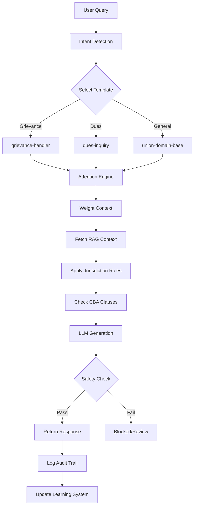

# Hereditary-Attentive Template-Based LLM Architecture

## Executive Summary

This document outlines the architectural design for a **hereditary-attentive template-based approach** for the Union Eyes app's LLM system. This approach combines **template inheritance** (hereditary) with **dynamic context weighting** (attentive) to create a highly maintainable, governance-compliant, and context-aware AI system.

---

## 1. Current Implementation Analysis

### 1.1 What's Already Built

The system already includes:

| Component | Status | Description |
|----------|--------|-------------|
| **Template Registry** | ✅ Complete | Hierarchical template system with inheritance |
| **Attention Weights** | ✅ Complete | Dynamic context prioritization |
| **Multi-Jurisdiction** | ✅ Complete | 11 Canadian jurisdictions supported |
| **Governance Layer** | ✅ Complete | Compliance tagging, audit logging |
| **Safety Filters** | ✅ Complete | Content safety, PII detection |
| **Mamba SSM Integration** | ✅ Complete | Long-context processing |
| **RAG Pipeline** | ✅ Complete | Hybrid search with embeddings |
| **Entity Extraction** | ✅ Complete | Union-specific NER |
| **Learning System** | ✅ Complete | Feedback collection, pattern detection |

### 1.2 Template Hierarchy (Hereditary System)

```
union-domain-base (Root)
├── member-services
│   ├── dues-inquiry
│   └── benefits-question
├── case-management
│   ├── grievance-handler
│   │   ├── grievance-filing
│   │   └── arbitration-prep
│   └── strike-fund
├── communications
│   ├── bargaining-update
│   ├── strike-notice
│   └── member-bulletin
└── governance
    ├── elections
    └── policy-query
```

---

## 2. How the Approach Works

### 2.1 Hereditary (Template Inheritance)

**Concept**: Child templates inherit all properties from parent templates, with the ability to override specific sections.

**Benefits**:

1. **Maintainability**
   - Change base prompt once → propagates to all children
   - No duplicate code across templates
   - Version control at each level

2. **Consistency**
   - Core principles inherited automatically
   - Compliance requirements propagate
   - Tone and style maintained

3. **Specialization**
   - Children can override specific sections
   - Add domain-specific context
   - Adjust attention weights

**Example**:
```typescript
// Parent: union-domain-base
{
  systemPrompt: "You are UnionEyes, an AI assistant specialized in labor union operations.",
  attentionWeights: { userQuery: 0.25, contextDocs: 0.25, ... }
}

// Child: member-services (inherits and extends)
{
  systemPrompt: "You are a Member Services representative for the union.",
  // Inherits: attentionWeights, complianceTags, jurisdictions
  // Extends: role-specific instructions
}
```

### 2.2 Attentive (Dynamic Context Weighting)

**Concept**: Different queries require different context priorities. The attention mechanism dynamically weights which information is most relevant.

**Attention Dimensions**:

| Dimension | Description | Example |
|-----------|-------------|---------|
| **User Query** | Direct relevance to user input | High for "what's my balance?" |
| **RAG Documents** | Retrieved knowledge base content | High for policy questions |
| **Session History** | Conversation context | High for follow-ups |
| **Jurisdiction Rules** | Provincial labor laws | High for legal queries |
| **CBA Clauses** | Collective agreement text | High for grievance context |
| **Timeline/Deadlines** | SLA, deadlines, dates | High for case status |

**Dynamic Adjustment**:
```typescript
// Example: Grievance filing → High CBA attention
{
  template: 'grievance-filing',
  attentionWeights: {
    userQuery: 0.20,
    contextDocs: 0.15,
    sessionHistory: 0.10,
    jurisdictionRules: 0.15,
    cbaClauses: 0.30,  // ← Highest for grievance work
    timelineContext: 0.10
  }
}

// Example: Dues inquiry → High user query focus
{
  template: 'dues-inquiry',
  attentionWeights: {
    userQuery: 0.35,  // ← Highest for direct questions
    contextDocs: 0.25,
    sessionHistory: 0.15,
    jurisdictionRules: 0.10,
    cbaClauses: 0.10,
    timelineContext: 0.05
  }
}
```

---

## 3. Architecture Benefits for Union Eyes

### 3.1 Multi-Jurisdiction Support

**Challenge**: Canadian unions operate across 11 jurisdictions with different labor laws.

**Solution**: Templates inherit jurisdiction rules and can override for province-specific nuances.

```typescript
// Base: Federal labor law
jurisdictionRules: ['federal', ...all provinces']

// Quebec override: Different language requirements
{
  parentTemplateId: 'member-services',
  overrides: {
    systemPrompt: " french language prompt...",
    // Uses inherited attention weights
  }
}
```

### 3.2 Governance & Compliance

**Built-in Compliance Tags**:
```typescript
complianceTags: [
  { category: 'privacy', requirement: 'PIPEDA', severity: 'critical' },
  { category: 'labor-law', requirement: 'Canada Labour Code', severity: 'critical' },
  { category: 'financial', requirement: 'Dues accuracy', severity: 'high' }
]
```

**Audit Trail**:
- Every prompt logged with template version
- Response metadata stored
- Cost attribution per template
- SLA monitoring per case

### 3.3 Integration with Existing Systems

The template engine integrates with:

| System | Integration Point |
|--------|------------------|
| **Claim Workflow FSM** | Case stage awareness |
| **SLA Calculator** | Deadline context |
| **LRO Signals** | Risk/property indicators |
| **RAG Pipeline** | Knowledge retrieval |
| **Entity Extraction** | Auto-entity detection |

---

## 4. Data Flow Architecture



---

## 5. Implementation Roadmap

### Phase 1: Foundation (Complete)
- [x] Template registry with inheritance
- [x] Attention weight system
- [x] Multi-jurisdiction support
- [x] Governance layer

### Phase 2: Intelligence (Complete)
- [x] RAG pipeline integration
- [x] Entity extraction
- [x] Mamba SSM for long context
- [x] Learning system

### Phase 3: Production Hardening (In Progress)
- [ ] Template A/B testing framework
- [ ] Performance monitoring dashboard
- [ ] Automated template updates from feedback
- [ ] Multi-model fallback strategy

---

## 6. Key Advantages Summary

| Advantage | Description |
|-----------|-------------|
| **Maintainability** | Single source of truth for core prompts |
| **Consistency** | Inherited behavior ensures uniform responses |
| **Flexibility** | Override specific sections without breaking parent |
| **Governance** | Built-in compliance tracking |
| **Auditability** | Full version history and prompt logging |
| **Scalability** | Add new use cases by extending existing templates |
| **Context-Aware** | Dynamic attention weights adapt to query type |
| **Jurisdiction-Aware** | Province-specific overrides with fallback |

---

## 7. Recommendations

1. **Template A/B Testing**: Implement a system to test different template versions and measure effectiveness
2. **Feedback Loop**: Use the learning system to auto-identify templates needing updates
3. **Monitoring Dashboard**: Create real-time visibility into template performance
4. **Automated Updates**: Build pipelines to update templates from feedback without manual intervention

---

*Document Version: 1.0*  
*Last Updated: 2026-02-13*  
*Architecture: Hereditary-Attentive Template System*
