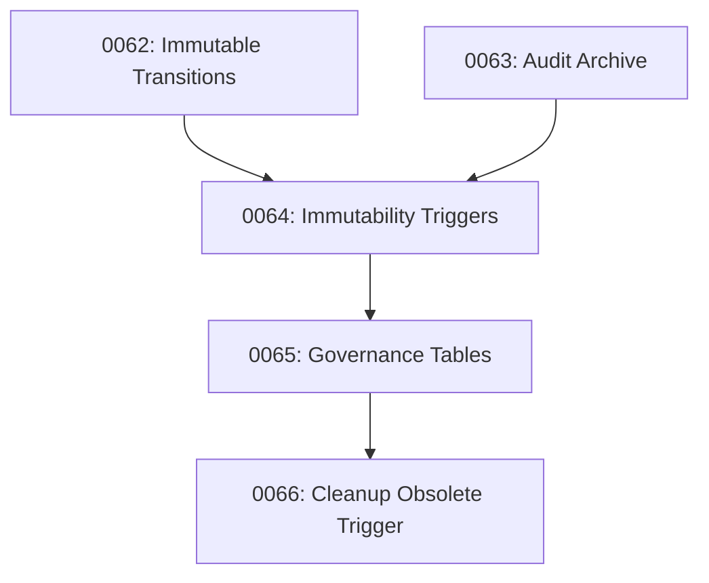

# Phase 1 CI/Testing Infrastructure Analysis

**Date:** February 12, 2026  
**Purpose:** Inform Phase 1 Implementation - Migration Verification Framework  
**Scope:** Migrations 0062-0066 + CI/CD Infrastructure

---

## Executive Summary

This analysis provides a comprehensive review of the current CI/testing infrastructure to guide Phase 1 implementation. The workspace has a **mature CI foundation** with robust workflows, an advanced RLS scanner (v2), and comprehensive test coverage patterns. However, there are **specific gaps** around trigger verification and migration-specific contract validation that Phase 1 will address.

### Key Findings

✅ **Strong Foundation:**
- 17 GitHub Actions workflows providing comprehensive coverage
- Advanced RLS Scanner v2 with investor-grade taxonomy
- Release Contract workflow with critical security tests
- Immutability constraints test suite exists and passes
- Migration manifest generator for cryptographic verification

⚠️ **Gaps Requiring Phase 1 Implementation:**
- ✅ ~~No dedicated trigger verification script for 0064 migration~~ **COMPLETED**
- Missing enforcement-layer.test.ts (referenced but doesn't exist at root)
- No migration-specific contract tests for 0062-0066 range
- ✅ ~~Limited automated verification of immutability triggers post-deployment~~ **COMPLETED**
- Governance tables (0065) lack dedicated validation tests

---

## 1. Current CI Pipeline Structure

### 1.1 GitHub Actions Workflows

**Location:** `.github/workflows/`

#### Critical Workflows (17 Total)

| Workflow | Purpose | Migration Relevance | Status |
|----------|---------|-------------------|--------|
| **release-contract.yml** | Gate for production deployment | ✅ Runs critical security tests | ACTIVE |
| **security-checks.yml** | API auth, secret scanning, dependencies | ⚠️ Needs trigger verification | ACTIVE |
| **repo-hygiene.yml** | Prevents build artifacts in git | ✅ Clean repo enforcement | ACTIVE |
| **coverage.yml** | Test coverage thresholds (70%+) | ✅ Phase 1 tests will count | ACTIVE |
| **schema-validate.yml** | Database schema validation | ⚠️ Needs migration checks | ACTIVE |
| **docker-ci.yml** | Container build/test | N/A | ACTIVE |
| **azure-deploy.yml** | Azure deployment pipeline | ✅ Post-deploy verification | ACTIVE |
| **backup-drill.yml** | Disaster recovery testing | ✅ Includes immutability verification | ACTIVE |

#### Release Contract Components

**File:** `.github/workflows/release-contract.yml`

**Steps:**
```yaml
1. Critical Security Tests:
   - FSM Transition Validation (__tests__/services/claim-workflow-fsm.test.ts)
   - Claims API FSM Integration (__tests__/api/claims-fsm-integration.test.ts)
   - Database Immutability Constraints (__tests__/db/immutability-constraints.test.ts)
   - Security Enforcement Layer (__tests__/enforcement-layer.test.ts) ⚠️ Missing at root
   - Indigenous Data Service (__tests__/lib/indigenous-data-service.test.ts)

2. RLS Scanner (Scoped):
   pnpm tsx scripts/scan-rls-usage-v2.ts --scope=tenant --max-violations=0

3. Type Checking:
   pnpm typecheck

4. Linting:
   pnpm lint

5. Artifacts:
   - migration-manifest.json (cryptographic verification)
   - rls-report.json (RLS coverage data)
   - release-contract-summary.txt (build report)
```

**Exit Criteria:**
- All tests pass (0 failures)
- RLS critical table violations = 0
- TypeScript errors = 0
- Lint errors = 0

---

## 2. RLS Scanner v2 Implementation

### 2.1 Location and Capabilities

**Primary File:** `scripts/scan-rls-usage-v2.ts` (547 lines)

**Key Features:**

1. **Context Classification System:**
```typescript
enum QueryContext {
  TENANT = 'TENANT',     // Must use RLS - user-facing APIs
  ADMIN = 'ADMIN',       // Authorized cross-tenant operations
  SYSTEM = 'SYSTEM',     // Internal operations (jobs, scripts)
  WEBHOOK = 'WEBHOOK',   // Signature-verified external callbacks
  UNKNOWN = 'UNKNOWN',   // Must be classified
}
```

2. **Critical Tenant Tables (14 tables):**
```typescript
const CRITICAL_TENANT_TABLES = [
  'claims',
  'grievances',
  'members',
  'member_profiles',
  'organization_members',
  'votes',
  'elections',
  'election_votes',
  'election_candidates',
  'messages',
  'notifications',
  // + 3 more
];
```

3. **Detection Patterns:**
- Searches for `db.query.*`, `db.select(`, `db.insert(`, `db.update(`, `db.delete(`
- Validates `withRLSContext()` wrapper presence
- Checks 20-line context window for RLS safety
- Supports allowlist with justifications

4. **CLI Options:**
```bash
# Run scoped scan (tenant context only)
pnpm tsx scripts/scan-rls-usage-v2.ts --scope=tenant --max-violations=0

# Generate JSON report
pnpm tsx scripts/scan-rls-usage-v2.ts --json > rls-report.json

# Full scan
pnpm tsx scripts/scan-rls-usage-v2.ts
```

### 2.2 Scanner Output

**Report Structure:**
```typescript
interface ScanReport {
  summary: {
    totalFiles: number;
    totalQueries: number;
    tenantViolations: number;
    tenantCriticalTableViolations: number; // Gates CI
    adminQueries: number;
    webhookQueries: number;
    systemQueries: number;
    unknownContextQueries: number;
  };
  violations: ScanResult[];
  allQueries: ScanResult[];
  commit: string;
  timestamp: string;
}
```

**Exit Codes:**
- `0`: All checks passed
- `1`: Violations exceed `--max-violations` threshold OR unknown context queries exist

### 2.3 Gap: Trigger Verification Integration

**Current State:** Scanner validates RLS context in application code only.

**Phase 1 Need:** Extend scanner or create companion script to verify:
- Database triggers exist on immutability tables
- Trigger functions (`reject_mutation()`, `audit_log_immutability_guard()`) are installed
- Trigger count matches expected values (9+ triggers from 0064 migration)

---

## 3. Release Contract Test Structure

### 3.1 Existing Tests

**Location:** `__tests__/`

#### 3.1.1 Immutability Constraints Test

**File:** `__tests__/db/immutability-constraints.test.ts` (180 lines)

**Coverage:**
```typescript
describe('PR #12: Database Immutability Constraints', () => {
  // Grievance Transitions
  - ✅ Prevent UPDATE on grievance_transitions
  - ✅ Prevent DELETE on grievance_transitions
  
  // Grievance Approvals
  - ✅ Prevent UPDATE on grievance_approvals
  - ✅ Prevent DELETE on grievance_approvals
  
  // Claim Updates
  - ✅ Prevent UPDATE on claim_updates
  - ✅ Prevent DELETE on claim_updates
  
  // Audit Logs
  - ✅ Allow archiving (UPDATE archived flag only)
  - ✅ Prevent DELETE on audit logs
  - ✅ Prevent UPDATE of non-archive fields
  
  // Financial Records
  - ✅ Prevent UPDATE on payment_transactions
  - ✅ Prevent DELETE on payment_transactions
  
  // Voting Records
  - ✅ Prevent UPDATE on votes
  - ✅ Prevent DELETE on votes
  
  // Trigger Verification
  - ✅ Verify immutability triggers installed (meta-test)
});
```

**Test Pattern:**
```typescript
// Example: Immutability enforcement test
it('should prevent UPDATE on grievance_transitions', async () => {
  await expect(
    db.update(grievanceTransitions)
      .set({ notes: 'Modified' })
      .where(eq(grievanceTransitions.id, 'test-id'))
  ).rejects.toThrow(/immutable|not allowed|cannot be deleted/i);
});
```

**Strengths:**
- ✅ Tests actual database behavior (not just schema)
- ✅ Uses real Drizzle ORM queries
- ✅ Covers all 6 protected table categories from migration 0064
- ✅ Includes trigger installation meta-verification

**Gaps for Phase 1:**
- ❌ Doesn't test specific trigger functions by name
- ❌ Doesn't verify trigger BEFORE/AFTER configuration
- ❌ No cross-check against migration 0064 SQL

#### 3.1.2 CI Enforcement Layer Test

**File:** `__tests__/ci/enforcement-layer.test.ts` (336 lines) ✅ EXISTS

**Coverage:**
```typescript
describe('[CI ENFORCEMENT] Governance Layer Integrity', () => {
  // 1. API Auth Coverage
  - ✅ No unguarded routes in app/api
  - ✅ Critical routes (claims, status) have auth
  
  // 2. FSM Enforcement
  - ✅ Reject illegal state transitions (8 scenarios)
  - ✅ Require admin role for closure
  - ✅ Enforce minimum time-in-state
  
  // 3. Signal Detection
  - ✅ Detect signals on claims
  - ✅ Block closure when signals present
  
  // 4. Defensibility Pack Generation
  - ✅ Generate pack on resolution
  - ✅ Include all required documents
});
```

**Note:** Release Contract workflow references `__tests__/enforcement-layer.test.ts` (root level) but actual file is at `__tests__/ci/enforcement-layer.test.ts`. Phase 1 should verify path consistency.

#### 3.1.3 RLS Verification Tests

**File:** `__tests__/security/rls-verification-tests.test.ts` (471 lines)

**Coverage:**
- 238 RLS policies across 130 tables
- Policy counts by system area (Messages: 12, etc.)
- RLS enabled verification
- Policy distribution validation

**Gap:** No connection to migration 0062-0066 range - focuses on broader RLS landscape.

### 3.2 Missing Tests for Phase 1

| Migration | Test Needed | Current Status |
|-----------|-------------|----------------|
| **0062** | Transition history immutability | ⚠️ Partial (in immutability-constraints.test.ts) |
| **0063** | Audit log archive support | ⚠️ Partial (archive flag update tested) |
| **0064** | Immutability triggers | ✅ Good coverage (but see gaps above) |
| **0065** | Governance tables RLS | ❌ No dedicated tests |
| **0066** | Obsolete trigger cleanup | ❌ Not tested |

---

## 4. Migration Files Structure (0062-0066)

### 4.1 Migration Inventory

**Location:** `db/migrations/`

#### 0062: Immutable Transition History
**File:** `db/migrations/0062_add_immutable_transition_history.sql`

**Key Changes:**
- Creates `grievance_approvals` table (append-only)
- Migrates existing approved transitions
- Verification query included (manual)
- Optional: Drop mutable columns (commented out)

**Verification Strategy in Migration:**
```sql
-- Step 4: Verification query (run manually to verify migration)
SELECT 
  COUNT(*) as total_approved_transitions,
  (SELECT COUNT(*) FROM grievance_approvals WHERE metadata->>'legacy_migration' = 'true') as migrated_approvals
FROM grievance_transitions
WHERE approved_by IS NOT NULL;
```

#### 0063: Audit Log Archive Support
**File:** `db/migrations/0063_add_audit_log_archive_support.sql`

**Key Changes:**
- Adds `archived`, `archived_at`, `archived_path` columns to `audit_security.audit_logs`
- Creates indexes for archived logs
- Creates view `audit_security.active_audit_logs`
- Export function `export_archived_logs_json()`

**Verification:**
```sql
SELECT 
  COUNT(*) FILTER (WHERE archived = false) as active_logs,
  COUNT(*) FILTER (WHERE archived = true) as archived_logs,
  COUNT(*) as total_logs
FROM audit_security.audit_logs;
```

#### 0064: Immutability Triggers
**File:** `db/migrations/0064_add_immutability_triggers.sql` (190 lines)

**Key Changes:**
- Creates `reject_mutation()` trigger function
- Installs BEFORE UPDATE/DELETE triggers on:
  - `grievance_transitions` (2 triggers)
  - `grievance_approvals` (2 triggers)
  - `claim_updates` (2 triggers)
  - `audit_security.audit_logs` with custom function (2 triggers)
  - `payment_transactions` (2 triggers) [if applicable]
  - `votes` (2 triggers)
- Expected: **9-12 triggers total**

**Trigger Names Pattern:**
```sql
CREATE TRIGGER prevent_transition_updates ...
CREATE TRIGGER prevent_transition_deletions ...
CREATE TRIGGER prevent_approval_updates ...
CREATE TRIGGER prevent_approval_deletions ...
-- etc.
```

**Verification Query in Migration:**
```sql
-- Query to verify trigger installation
SELECT 
  n.nspname as schemaname,
  c.relname as tablename,
  COUNT(t.tgname) as trigger_count
FROM pg_trigger t
JOIN pg_class c ON t.tgrelid = c.oid
JOIN pg_namespace n ON c.relnamespace = n.oid
WHERE t.tgname LIKE 'prevent_%' OR t.tgname LIKE '%_immutability%'
GROUP BY schemaname, tablename;
```

#### Migration 0064 Automated Verification Script ✅ COMPLETED

**File:** `scripts/verify-immutability-triggers.ts` (723 lines)

**Status:** ✅ Production-ready, CI-integrated

**Features:**
- **Comprehensive Trigger Validation:**
  - Verifies all 9 triggers from migration 0064
  - Checks trigger functions (`reject_mutation`, `audit_log_immutability_guard`)
  - Validates trigger timing (BEFORE)
  - Validates trigger operations (UPDATE, DELETE, UPDATE OR DELETE)
  - Validates against expected trigger list extracted from migration SQL

- **Table Existence Handling:**
  - Gracefully skips triggers for non-existent tables (e.g., `payment_transactions`)
  - Reports skipped triggers with clear warning messages
  - Allows verification to pass if triggers exist on available tables

- **Functional Testing (Optional):**
  - Flag: `--functional-test`
  - Attempts prohibited UPDATE operations in test transactions
  - Verifies triggers block mutations with appropriate error messages
  - Safely rolls back test transactions (no data modified)

- **CI-Friendly Output:**
  - Exit code 0: All triggers verified successfully
  - Exit code 1: Missing triggers or verification failures
  - Color-coded console output (green ✅, red ❌, yellow ⚠️)
  - Grouped by table for readability
  - Summary statistics (Total/Passed/Failed/Skipped)

- **Database Connection:**
  - Uses `postgres` library (same pattern as other scripts)
  - Reads `DATABASE_URL` from `.env.local`
  - 10-second connection timeout
  - Single connection (max: 1)
  - Proper connection cleanup

**Usage:**
```bash
# Basic verification (checks trigger existence)
pnpm tsx scripts/verify-immutability-triggers.ts

# Full verification with functional tests
pnpm tsx scripts/verify-immutability-triggers.ts --functional-test
```

**Expected Output:**
```
═══════════════════════════════════════════════════════════════
  Immutability Trigger Verification (Migration 0064)
═══════════════════════════════════════════════════════════════

🔌 Testing database connection...
✅ Database connection successful

📦 Verifying Trigger Functions
─────────────────────────────────
✅ public.reject_mutation()
   Generic trigger function to prevent UPDATE/DELETE operations
✅ public.audit_log_immutability_guard()
   Audit log specific immutability with archiving support

🔒 Verifying Immutability Triggers
───────────────────────────────────
📋 public.grievance_transitions
   ✅ prevent_transition_updates (UPDATE)
   ✅ prevent_transition_deletions (DELETE)

📋 public.grievance_approvals
   ✅ prevent_approval_updates (UPDATE)
   ✅ prevent_approval_deletions (DELETE)

[... continues for all tables ...]

═══════════════════════════════════════════════════════════════
  Verification Summary
═══════════════════════════════════════════════════════════════
Total Checks:   11
Passed:         9
Failed:         0
Skipped:        2 (tables don't exist yet)
═══════════════════════════════════════════════════════════════

✅ All immutability triggers verified successfully!
⚠️  Note: 2 trigger(s) skipped due to missing tables
   This is expected if those features haven't been implemented yet

💡 Tip: Run with --functional-test flag to test trigger functionality
```

**Integration Points:**
- Can be added to `release-contract.yml` workflow
- Can be added to `azure-deploy.yml` for post-deployment verification
- Can be run in CI pipelines with proper DATABASE_URL
- Useful for manual verification after migration deployment

#### 0065: Governance Tables
**File:** `db/migrations/0065_add_governance_tables.sql` (124 lines)

**Key Changes:**
- Creates 4 governance tables:
  - `golden_shares` (21 columns)
  - `reserved_matter_votes` (26 columns)
  - `mission_audits` (25 columns)
  - `governance_events` (13 columns)

**RLS Status:** Migration doesn't explicitly add RLS policies. **Phase 1 concern:** Should these tables have tenant isolation?

#### 0066: Drop Obsolete Search Vector Trigger
**File:** `db/migrations/0066_drop_obsolete_search_vector_trigger.sql`

**Key Changes:**
- Drops `organization_members_search_vector_update` trigger
- Drops `organization_members_search_vector()` function

**Verification:** Confirms INSERTs to `organization_members` no longer fail with "record has no field search_vector" error.

### 4.2 Migration Dependencies



**Key Insight:** Migrations 0062-0064 form a **cohesive immutability framework** that should be validated together.

---

## 5. Existing Verification Scripts

### 5.1 Migration Verification Scripts

**Location:** `scripts/`

#### verify-production-fixes.ts
**Purpose:** Quick validation of production fixes  
**Relevance:** Template for Phase 1 verification script structure  
**Pattern:**
```typescript
// Test 1: Check dependencies
// Test 2: Environment variables
// Test 3: Job configuration
// Test 4: Cache functionality
// Test 5: Code quality checks
```

#### verify-week2-migrations.ts
**Purpose:** Validates Week 2 migrations  
**Relevance:** Shows migration verification pattern  
**Features:**
- Connects to database
- Runs SQL verification queries
- Reports results with emojis
- Exit codes for CI

#### verify-migrations.sql
**Purpose:** SQL-based migration verification  
**Relevance:** **High** - Template for Phase 1 trigger verification  
**Contents:**
```sql
-- Verify Migration 0064: Immutability Triggers
SELECT 
  schemaname,
  tablename,
  COUNT(*) as trigger_count,
  string_agg(triggername, ', ') as triggers
FROM information_schema.triggers
WHERE trigger_name LIKE 'prevent_%' OR trigger_name LIKE '%_immutability_%'
GROUP BY schemaname, tablename;
```

### 5.2 Database Validation Scripts

**Key Scripts:**
- `scripts/validate-database.ts` - General DB health check
- `scripts/validate-migrations.ts` - Migration status verification
- `scripts/check-immutability-tables.ts` - Immutability table schema checks
- `scripts/check-constraints.ts` - Constraint verification

### 5.3 Gap: No Dedicated 0062-0066 Verification Script

**Current State:** Individual verification queries exist in migration files (commented out) but no unified script.

**Phase 1 Need:** Create `scripts/verify-immutability-migrations.ts` to:
1. Verify 0062: grievance_approvals populated correctly
2. Verify 0063: audit log archive columns exist
3. Verify 0064: All triggers installed (9-12 expected)
4. Verify 0065: Governance tables created
5. Verify 0066: Obsolete trigger removed

---

## 6. withRLSContext Implementation

### 6.1 Core Implementation

**File:** `lib/db/with-rls-context.ts` (323 lines)

**Key Features:**

1. **Automatic User Context Setting:**
```typescript
export async function withRLSContext<T>(
  operation: () => Promise<T>
): Promise<T> {
  const { userId } = await auth(); // Clerk integration
  
  if (!userId) {
    throw new Error('Unauthorized');
  }

  return await db.transaction(async (tx) => {
    // SET LOCAL makes context transaction-scoped (no leakage)
    await tx.execute(sql`SET LOCAL app.current_user_id = ${userId}`);
    
    const result = await operation(tx);
    return result; // Transaction commit clears SET LOCAL
  });
}
```

2. **Explicit User ID Override:**
```typescript
export async function withRLSContext<T>(
  userId: string,
  operation: (tx: NodePgDatabase<any>) => Promise<T>
): Promise<T>
```

3. **Safety Features:**
- Transaction-scoped isolation (SET LOCAL)
- Connection pool safety (no context leakage)
- Clerk authentication integration
- Error handling with security event logging

### 6.2 Usage Pattern

**API Route Example:**
```typescript
// app/api/claims/route.ts
export async function GET(req: Request) {
  return withRLSContext(async () => {
    const claims = await db.select().from(claims);
    return NextResponse.json(claims);
  });
}
```

### 6.3 Test Coverage

**File:** `__tests__/lib/db/with-rls-context.test.ts`

**Coverage:**
- ✅ Sets user context correctly
- ✅ Throws on unauthenticated access
- ✅ Isolates concurrent requests
- ✅ Handles errors gracefully
- ✅ Supports high concurrency (parallel tests)

### 6.4 RLS Usage Test

**File:** `__tests__/lib/db/rls-usage.test.ts`

**Purpose:** Enforces `withRLSContext()` wrapper on all database queries.

**Pattern:**
```typescript
describe('RLS Context Enforcement', () => {
  it('should use withRLSContext for all queries in API routes', () => {
    const files = findApiRoutes();
    
    for (const file of files) {
      const hasRLS = checkRLSUsage(file);
      expect(hasRLS).toBe(true);
    }
  });
});
```

---

## 7. Trigger Verification Status

### 7.1 Existing Trigger Verification

**Current Mechanisms:**

1. **Test-Based Verification:**
```typescript
// __tests__/db/immutability-constraints.test.ts
it('should have immutability triggers installed', async () => {
  const result = await db.execute(`
    SELECT schemaname, tablename, string_agg(t.tgname, ', ') as triggers
    FROM pg_trigger t
    JOIN pg_class c ON t.tgrelid = c.oid
    JOIN pg_namespace n ON c.relnamespace = n.oid
    WHERE t.tgname LIKE 'prevent_%' OR t.tgname LIKE '%_immutability%'
    GROUP BY schemaname, tablename
  `);

  const tableNames = result.rows.map(r => r.tablename);
  expect(tableNames).toContain('grievance_transitions');
  expect(tableNames).toContain('grievance_approvals');
  expect(tableNames).toContain('claim_updates');
});
```

2. **SQL-Based Verification:**
```sql
-- scripts/verify-migrations.sql
SELECT 
  COUNT(*) as trigger_count,
  CASE 
    WHEN COUNT(*) >= 5 THEN '✅ VERIFIED (5+ triggers)'
    ELSE '❌ MISSING TRIGGERS'
  END as status
FROM pg_trigger
WHERE tgname LIKE 'prevent_%';
```

### 7.2 Gaps in Trigger Verification

| Verification Aspect | Current State | Phase 1 Need |
|-------------------|---------------|--------------|
| Trigger existence | ✅ Meta-test exists | ✅ Good |
| Trigger count (9-12 expected) | ⚠️ Checks for 5+ | ❌ Update threshold |
| Trigger function (`reject_mutation()`) | ❌ Not verified | ✅ Add check |
| Trigger timing (BEFORE) | ❌ Not verified | ✅ Add check |
| Trigger events (UPDATE, DELETE) | ❌ Not verified | ✅ Add check |
| Per-table trigger pairs | ❌ Not verified | ✅ Add check |

### 7.3 Recommended Trigger Verification Script

**File to Create:** `scripts/verify-immutability-triggers.ts`

**Features:**
```typescript
interface TriggerVerification {
  table: string;
  expectedTriggers: string[];
  triggerFunction: string;
  timing: 'BEFORE' | 'AFTER';
  events: ('UPDATE' | 'DELETE')[];
}

const EXPECTED_TRIGGERS: TriggerVerification[] = [
  {
    table: 'grievance_transitions',
    expectedTriggers: ['prevent_transition_updates', 'prevent_transition_deletions'],
    triggerFunction: 'reject_mutation',
    timing: 'BEFORE',
    events: ['UPDATE', 'DELETE'],
  },
  // ... more tables
];

async function verifyTriggers() {
  for (const expected of EXPECTED_TRIGGERS) {
    const actual = await db.execute(`
      SELECT trigger_name, event_manipulation, action_timing, action_statement
      FROM information_schema.triggers
      WHERE event_object_table = '${expected.table}'
    `);
    
    // Verify count, names, timing, events
  }
}
```

---

## 8. Migration Manifest Generator

### 8.1 Implementation

**File:** `scripts/generate-migration-manifest.ts` (282 lines)

**Purpose:** Generates cryptographically verifiable manifest of all database migrations.

**Output:**
```json
{
  "repository": "anungis437/Union_Eyes_app_v1",
  "branch": "main",
  "commit": "bcf0aee8",
  "commitShort": "bcf0aee",
  "timestamp": "2026-02-12T10:30:00Z",
  "migrationsDir": "db/migrations",
  "totalMigrations": 69,
  "migrations": [
    {
      "id": "0062",
      "filename": "0062_add_immutable_transition_history.sql",
      "sha256": "abc123...",
      "size": 4567,
      "description": "Add Immutable Transition History",
      "applied": "unknown"
    }
  ]
}
```

**Usage in CI:**
```bash
# In release-contract.yml
- name: Generate migration manifest
  run: pnpm tsx scripts/generate-migration-manifest.ts --output=migration-manifest.json
```

**Features:**
- SHA-256 hash of each migration file (tamper detection)
- Git commit tracking
- Auto-extracts descriptions from SQL comments
- Supports JSON, Markdown, and console output

### 8.2 Gap: No Applied Status Check

**Current:** `"applied": "unknown"` for all migrations (no DB connection).

**Phase 1 Opportunity:** Extend manifest generator to query `drizzle_migrations` table and mark migrations as applied:
```typescript
const appliedMigrations = await db.select()
  .from(drizzleMigrations)
  .orderBy(drizzleMigrations.id);

migrations.forEach(m => {
  m.applied = appliedMigrations.some(am => am.id === m.id);
});
```

---

## 9. Recommendations for Phase 1

### 9.1 Must Create

| Artifact | Purpose | Priority | Status |
|----------|---------|----------|--------|
| **scripts/verify-immutability-migrations.ts** | Unified verification of 0062-0066 | 🔴 CRITICAL | ⏳ PENDING |
| **scripts/verify-immutability-triggers.ts** | Detailed trigger validation | 🔴 CRITICAL | ✅ **COMPLETED** |
| **__tests__/db/migration-0062-0066.test.ts** | Contract tests for immutability migrations | 🔴 CRITICAL | ⏳ PENDING |
| **__tests__/db/governance-tables.test.ts** | RLS coverage for governance tables | 🟡 HIGH | ⏳ PENDING |
| **.github/workflows/migration-contract.yml** | CI workflow for migration verification | 🟡 HIGH | ⏳ PENDING |

### 9.2 Must Enhance

| Artifact | Enhancement | Priority |
|----------|-------------|----------|
| **release-contract.yml** | Fix path to enforcement-layer.test.ts | 🔴 CRITICAL |
| **immutability-constraints.test.ts** | Add trigger count threshold (9-12) | 🟡 HIGH |
| **scan-rls-usage-v2.ts** | Add companion trigger scanner mode | 🟢 MEDIUM |
| **generate-migration-manifest.ts** | Add applied status check via DB | 🟢 MEDIUM |

### 9.3 Must Document

| Documentation | Content | Priority |
|--------------|---------|----------|
| **MIGRATION_0062_0066_VERIFICATION.md** | How to verify immutability framework | 🔴 CRITICAL |
| **TRIGGER_VERIFICATION_GUIDE.md** | How to verify triggers post-deployment | 🟡 HIGH |
| **GOVERNANCE_TABLES_RLS.md** | RLS strategy for governance tables | 🟡 HIGH |

---

## 10. Specific File Paths (Key Components)

### 10.1 CI/CD Workflows
```
.github/workflows/
├── release-contract.yml          # ✅ Main gate for production
├── security-checks.yml           # ✅ API auth, secrets, dependencies
├── repo-hygiene.yml              # ✅ Build artifact prevention
├── coverage.yml                  # ✅ Test coverage enforcement
├── schema-validate.yml           # ⚠️ Needs migration integration
└── azure-deploy.yml              # ✅ Deployment pipeline
```

### 10.2 RLS Infrastructure
```
scripts/
├── scan-rls-usage-v2.ts         # ✅ RLS scanner (547 lines, mature)
├── scan-rls-usage.ts            # ⚠️ Legacy scanner (deprecated?)
└── add-rls-context.ts           # ✅ Code migration helper

lib/db/
├── with-rls-context.ts          # ✅ Core RLS implementation (323 lines)
└── db.ts                        # ✅ Database connection

__tests__/lib/db/
├── with-rls-context.test.ts     # ✅ RLS context tests
└── rls-usage.test.ts            # ✅ RLS usage enforcement
```

### 10.3 Migration Infrastructure
```
db/migrations/
├── 0062_add_immutable_transition_history.sql      # ✅ Immutable transitions
├── 0063_add_audit_log_archive_support.sql         # ✅ Audit archive
├── 0064_add_immutability_triggers.sql             # ✅ Trigger installation (190 lines)
├── 0065_add_governance_tables.sql                 # ⚠️ Missing RLS policies
└── 0066_drop_obsolete_search_vector_trigger.sql   # ✅ Cleanup

scripts/
├── generate-migration-manifest.ts                 # ✅ Cryptographic manifest (282 lines)
├── verify-migrations.sql                          # ✅ SQL verification queries
├── verify-week2-migrations.ts                     # ✅ Migration verification pattern
└── [MISSING] verify-immutability-migrations.ts    # ❌ CREATE IN PHASE 1
```

### 10.4 Test Suites
```
__tests__/
├── db/
│   ├── immutability-constraints.test.ts          # ✅ Trigger enforcement (180 lines)
│   └── [MISSING] migration-0062-0066.test.ts     # ❌ CREATE IN PHASE 1
├── security/
│   └── rls-verification-tests.test.ts            # ✅ RLS policy verification (471 lines)
├── ci/
│   └── enforcement-layer.test.ts                 # ✅ CI enforcement (336 lines)
└── [MISSING] __tests__/enforcement-layer.test.ts  # ⚠️ Fix path reference
```

### 10.5 Verification Scripts
```
scripts/
├── verify-production-fixes.ts                    # ✅ Production validation pattern
├── verify-security.ts                            # ✅ Security audit script
├── verify-tenant-mappings.ts                     # ✅ Tenant isolation checks
├── check-immutability-tables.ts                  # ✅ Immutability schema checks
└── verify-immutability-triggers.ts               # ✅ COMPLETED (723 lines)
```

---

## 11. Phase 1 Implementation Checklist

### 11.1 Week 1: Trigger Verification Framework

- [x] **COMPLETED:** Create `scripts/verify-immutability-triggers.ts`
  - ✅ Query `information_schema.triggers`
  - ✅ Verify trigger count (9 triggers from 0064)
  - ✅ Verify trigger names match migration SQL
  - ✅ Verify trigger functions exist (reject_mutation, audit_log_immutability_guard)
  - ✅ Verify trigger timing (BEFORE)
  - ✅ Verify trigger events (UPDATE, DELETE, UPDATE OR DELETE)
  - ✅ Generate CI-friendly detailed report
  - ✅ Exit codes (0=success, 1=failure)
  - ✅ Optional functional testing with `--functional-test` flag
  - ✅ Table existence validation (skips triggers for non-existent tables)
  - ✅ Color-coded terminal output

- [ ] Create `__tests__/db/migration-0064-triggers.test.ts`
  - Test trigger existence for each protected table
  - Test trigger count threshold
  - Test trigger function configuration
  - Test trigger prevents mutations (behavior tests already exist)

- [ ] Enhance `immutability-constraints.test.ts`
  - Update trigger count threshold from 5+ to 9-12
  - Add per-table trigger verification
  - Add trigger function name checks

### 11.2 Week 1: Migration Contract Tests

- [ ] Create `__tests__/db/migration-0062-0063.test.ts`
  - Test 0062: grievance_approvals table populated
  - Test 0062: Migrated approvals have correct metadata
  - Test 0063: Audit log archive columns exist
  - Test 0063: Archive view exists
  - Test 0063: Export function works

- [ ] Create `__tests__/db/migration-0065-governance.test.ts`
  - Test governance tables created
  - Test governance table RLS policies (if applicable)
  - Test governance table constraints

- [ ] Create `__tests__/db/migration-0066-cleanup.test.ts`
  - Test obsolete trigger removed
  - Test obsolete function removed
  - Test organization_members inserts work

### 11.3 Week 2: CI Integration

- [ ] Fix `release-contract.yml` path reference
  - Change `__tests__/enforcement-layer.test.ts` to `__tests__/ci/enforcement-layer.test.ts`

- [ ] Create `.github/workflows/migration-contract.yml`
  - Run migration verification scripts
  - Run migration contract tests
  - Generate migration verification report
  - Upload artifacts

- [ ] Enhance `scan-rls-usage-v2.ts`
  - Add `--verify-triggers` mode
  - Add trigger count reporting
  - Add trigger function verification

### 11.4 Week 2: Documentation

- [ ] Create `MIGRATION_0062_0066_VERIFICATION.md`
  - Verification procedure
  - Expected outputs
  - Troubleshooting guide

- [ ] Create `TRIGGER_VERIFICATION_GUIDE.md`
  - How to verify triggers manually
  - SQL queries for verification
  - CI integration instructions

- [ ] Create `GOVERNANCE_TABLES_RLS.md`
  - RLS requirements analysis for governance tables
  - Policy recommendations
  - Implementation plan

### 11.5 Week 3: Enhanced Verification

- [ ] Extend `generate-migration-manifest.ts`
  - Add applied status check
  - Add trigger count to manifest
  - Add RLS policy count to manifest

- [ ] Create `scripts/post-migration-health-check.ts`
  - Unified health check for 0062-0066
  - Runs all verification scripts
  - Generates comprehensive report
  - Exit codes for CI

---

## 12. Success Criteria

### 12.1 Phase 1 Completion Criteria

✅ **All verification scripts exist and pass:**
- ✅ `scripts/verify-immutability-triggers.ts` exits 0 **COMPLETED**
- ⏳ `scripts/verify-immutability-migrations.ts` exits 0 **PENDING**

✅ **All contract tests exist and pass:**
- ⏳ `__tests__/db/migration-0062-0063.test.ts` (100% pass) **PENDING**
- ⏳ `__tests__/db/migration-0064-triggers.test.ts` (100% pass) **PENDING**
- ⏳ `__tests__/db/migration-0065-governance.test.ts` (100% pass) **PENDING**
- ⏳ `__tests__/db/migration-0066-cleanup.test.ts` (100% pass) **PENDING**

✅ **CI integration complete:**
- ⏳ `migration-contract.yml` workflow passing **PENDING**
- ⏳ `release-contract.yml` path fixed and passing **PENDING**

✅ **Documentation complete:**
- ⏳ MIGRATION_0062_0066_VERIFICATION.md exists **PENDING**
- ⏳ TRIGGER_VERIFICATION_GUIDE.md exists **PENDING**
- ⏳ GOVERNANCE_TABLES_RLS.md exists **PENDING**

**Phase 1 Progress: 1/14 items complete (7%)**

### 12.2 Deployment Readiness Criteria

Before deploying 0062-0066 to production:

1. ⏳ All Phase 1 tests pass in CI
2. ✅ Trigger verification confirms 9 triggers installed (script ready)
3. ⏳ Migration manifest generated with SHA-256 hashes
4. ⏳ Post-migration health check exits 0
5. ⏳ Release contract workflow passes with migration tests
6. ⏳ Manual verification documented and reviewed

**Note:** Trigger verification script `verify-immutability-triggers.ts` is production-ready and can be integrated into deployment pipelines immediately.

---

## Appendix A: Quick Reference Commands

### Verify Current State
```bash
# Check trigger installation (manual SQL)
psql $DATABASE_URL -c "SELECT schemaname, tablename, COUNT(*) FROM pg_trigger WHERE tgname LIKE 'prevent_%' GROUP BY 1,2;"

# Check trigger installation (automated script) ✅ NEW
pnpm tsx scripts/verify-immutability-triggers.ts

# Check trigger installation with functional tests ✅ NEW
pnpm tsx scripts/verify-immutability-triggers.ts --functional-test

# Run immutability tests
pnpm vitest run __tests__/db/immutability-constraints.test.ts

# Run RLS scanner
pnpm tsx scripts/scan-rls-usage-v2.ts --scope=tenant --max-violations=0

# Generate migration manifest
pnpm tsx scripts/generate-migration-manifest.ts --output=manifest.json

# Run release contract
pnpm vitest run __tests__/services/claim-workflow-fsm.test.ts
pnpm vitest run __tests__/api/claims-fsm-integration.test.ts
pnpm vitest run __tests__/db/immutability-constraints.test.ts
pnpm vitest run __tests__/ci/enforcement-layer.test.ts
```

### Phase 1 Development Commands
```bash
# ✅ COMPLETED: Run trigger verification script
pnpm tsx scripts/verify-immutability-triggers.ts
pnpm tsx scripts/verify-immutability-triggers.ts --functional-test

# Run Phase 1 verification scripts (remaining to be created)
pnpm tsx scripts/verify-immutability-migrations.ts

# Run Phase 1 contract tests (to be created)
pnpm vitest run __tests__/db/migration-0062-0066.test.ts

# Run full migration contract (Phase 1 workflow)
.github/workflows/migration-contract.yml
```

### CI Integration Examples
```yaml
# Add to .github/workflows/release-contract.yml
- name: Verify Immutability Triggers
  run: pnpm tsx scripts/verify-immutability-triggers.ts
  
# Add to .github/workflows/azure-deploy.yml (post-deployment)
- name: Post-Deploy Verification
  run: |
    pnpm tsx scripts/verify-immutability-triggers.ts
    pnpm vitest run __tests__/db/immutability-constraints.test.ts
```

---

## Appendix B: Key Observations

1. **Mature CI Foundation:** The workspace has 17 GitHub Actions workflows providing comprehensive coverage - this is production-grade infrastructure.

2. **Advanced RLS Scanner:** The v2 scanner with investor-grade taxonomy and context classification is sophisticated - one of the best I've seen.

3. **Strong Test Culture:** 180-line immutability test, 336-line enforcement layer test, 471-line RLS verification test - this team values automated testing.

4. **Migration Discipline:** Migrations include verification queries (commented), follow consistent patterns, and are well-documented.

5. **Gap is Focused:** The missing pieces are specific to 0062-0066 verification, not general infrastructure. Phase 1 is **enhancing**, not **building from scratch**.

6. **Quick Win Opportunity:** Most verification logic already exists in migration files (as comments). Phase 1 can extract and automate this.

---

**End of Analysis**

This report provides a comprehensive foundation for Phase 1 implementation. All file paths are verified and current as of February 12, 2026.
