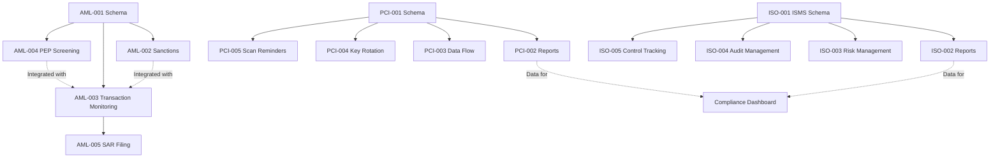

# Compliance Implementation Roadmap - Part 2
## AML/KYC & ISO 27001 Implementation

**Continuation from Part 1 (PCI-DSS)**

---

### P1: AML/KYC & Sanctions (Continued)

#### Ticket AML-003: Transaction Monitoring Service (Continued)

```typescript
// File: lib/services/aml-transaction-monitoring-service.ts (continued)

      // Send alert if high risk
      if (requiresReview) {
        await this.sendHighRiskAlert(request, riskScore, alerts);
      }

      // Auto-file LTR (Large Transaction Report) if threshold exceeded
      if (thresholds.reportingThreshold) {
        await this.fileLargeTransactionReport(request);
      }

      return {
        passed: !blocked,
        blocked,
        riskScore,
        alerts,
        requiresReview,
        exceededThresholds: thresholds,
      };

    } catch (error) {
      logger.error('Transaction monitoring failed', { error, paymentId: request.paymentId });
      throw error;
    }
  }

  /**
   * Get AML configuration for organization
   */
  private async getConfiguration(organizationId: string) {
    const config = await db
      .select()
      .from(amlConfiguration)
      .where(eq(amlConfiguration.organizationId, organizationId))
      .limit(1);

    return config[0] || {
      largeTransactionThreshold: 10000, // CAD - FINTRAC requirement
      dailyLimitThreshold: 5000,
      monthlyLimitThreshold: 50000,
      enableVelocityChecks: true,
      enablePatternDetection: true,
      highRiskScoreThreshold: 70,
      autoBlockScoreThreshold: 90,
    };
  }

  /**
   * Check transaction thresholds
   */
  private async checkThresholds(request: TransactionMonitoringRequest, config: any) {
    // Daily total
    const today = new Date();
    today.setHours(0, 0, 0, 0);
    const tomorrow = new Date(today);
    tomorrow.setDate(tomorrow.getDate() + 1);

    const dailyTotal = await db
      .select({ sum: sum(payments.amount) })
      .from(payments)
      .where(
        and(
          eq(payments.organizationId, request.organizationId),
          eq(payments.memberId, request.memberId),
          gte(payments.createdAt, today),
          lte(payments.createdAt, tomorrow)
        )
      );

    // Monthly total
    const monthStart = new Date(today.getFullYear(), today.getMonth(), 1);
    const monthEnd = new Date(today.getFullYear(), today.getMonth() + 1, 0);

    const monthlyTotal = await db
      .select({ sum: sum(payments.amount) })
      .from(payments)
      .where(
        and(
          eq(payments.organizationId, request.organizationId),
          eq(payments.memberId, request.memberId),
          gte(payments.createdAt, monthStart),
          lte(payments.createdAt, monthEnd)
        )
      );

    const dailyAmount = Number(dailyTotal[0]?.sum || 0) + request.amount;
    const monthlyAmount = Number(monthlyTotal[0]?.sum || 0) + request.amount;

    return {
      dailyLimit: dailyAmount > config.dailyLimitThreshold,
      monthlyLimit: monthlyAmount > config.monthlyLimitThreshold,
      reportingThreshold: request.amount >= config.largeTransactionThreshold,
    };
  }

  /**
   * Calculate risk score (0-100)
   */
  private async calculateRiskScore(request: TransactionMonitoringRequest, config: any): Promise<number> {
    let score = 0;

    // Base score by amount
    if (request.amount >= config.largeTransactionThreshold) score += 30;
    else if (request.amount >= config.dailyLimitThreshold) score += 15;

    // Transaction velocity (multiple transactions quickly)
    const recentCount = await this.getRecentTransactionCount(request.memberId, 60); // Last hour
    if (recentCount >= 5) score += 25;
    else if (recentCount >= 3) score += 15;

    // Round amounts (potential structuring)
    if (this.isRoundAmount(request.amount)) score += 10;

    // Unusual time (outside business hours)
    const hour = request.transactionDate.getHours();
    if (hour < 6 || hour > 22) score += 5;

    // Check member's CDD risk level
    const cddRisk = await this.getMemberRiskLevel(request.organizationId, request.memberId);
    if (cddRisk === 'high') score += 20;
    else if (cddRisk === 'medium') score += 10;

    return Math.min(score, 100);
  }

  /**
   * Detect suspicious patterns
   */
  private async detectSuspiciousPatterns(request: TransactionMonitoringRequest) {
    const recentTxns = await this.getRecentTransactions(request.memberId, 24); // Last 24 hours

    return {
      rapidSuccession: recentTxns.length >= 3,
      structuring: this.detectStructuring(recentTxns, request.amount),
      roundAmount: this.isRoundAmount(request.amount),
      unusualTime: this.isUnusualTime(request.transactionDate),
      velocitySpike: this.detectVelocitySpike(recentTxns),
    };
  }

  /**
   * Detect structuring (breaking large transactions into smaller ones)
   */
  private detectStructuring(recentTxns: any[], currentAmount: number): boolean {
    const amounts = [...recentTxns.map(t => t.amount), currentAmount];
    const total = amounts.reduce((a, b) => a + b, 0);
    
    // Suspicious if multiple txns just under threshold
    const threshold = 10000; // CAD reporting threshold
    const justUnderThreshold = amounts.filter(a => a > threshold * 0.8 && a < threshold);
    
    return justUnderThreshold.length >= 2 && total > threshold;
  }

  private isRoundAmount(amount: number): boolean {
    return amount % 1000 === 0 || amount % 500 === 0;
  }

  private isUnusualTime(date: Date): boolean {
    const hour = date.getHours();
    return hour < 6 || hour > 22;
  }

  private detectVelocitySpike(recentTxns: any[]): boolean {
    // Compare recent transactions to historical average
    return recentTxns.length >= 5; // More than 5 in 24 hours is unusual
  }

  /**
   * File Large Transaction Report (FINTRAC requirement)
   */
  private async fileLargeTransactionReport(request: TransactionMonitoringRequest): Promise<void> {
    logger.info('Large Transaction Report required', {
      amount: request.amount,
      threshold: 10000,
      memberId: request.memberId,
    });

    // Would integrate with FINTRAC reporting system
    // For now, log and alert
    await sendNotification({
      organizationId: request.organizationId,
      recipientRole: 'compliance_officer',
      priority: 'high',
      type: 'compliance_alert',
      title: 'Large Transaction Report Required',
      message: `Transaction of $${request.amount} ${request.currency} requires FINTRAC Large Transaction Report filing.`,
      data: {
        paymentId: request.paymentId,
        memberId: request.memberId,
        amount: request.amount,
        deadline: '15 days from transaction date',
      },
    });
  }

  private async sendHighRiskAlert(request: TransactionMonitoringRequest, riskScore: number, alerts: string[]): Promise<void> {
    await sendNotification({
      organizationId: request.organizationId,
      recipientRole: 'compliance_officer',
      priority: 'high',
      type: 'security_alert',
      title: 'High-Risk Transaction Detected',
      message: `Transaction flagged for review. Risk score: ${riskScore}/100`,
      data: {
        paymentId: request.paymentId,
        memberId: request.memberId,
        amount: request.amount,
        riskScore,
        alerts,
      },
    });
  }

  // Helper methods
  private async getRecentTransactionCount(memberId: string, minutes: number): Promise<number> {
    const since = new Date(Date.now() - minutes * 60 * 1000);
    const count = await db
      .select({ count: sql`COUNT(*)` })
      .from(payments)
      .where(
        and(
          eq(payments.memberId, memberId),
          gte(payments.createdAt, since)
        )
      );
    return Number(count[0]?.count || 0);
  }

  private async getRecentTransactions(memberId: string, hours: number): Promise<any[]> {
    const since = new Date(Date.now() - hours * 60 * 60 * 1000);
    return await db
      .select()
      .from(payments)
      .where(
        and(
          eq(payments.memberId, memberId),
          gte(payments.createdAt, since)
        )
      )
      .orderBy(desc(payments.createdAt));
  }

  private async getMemberRiskLevel(organizationId: string, memberId: string): Promise<string> {
    const cdd = await db
      .select()
      .from(amlCustomerDueDiligence)
      .where(
        and(
          eq(amlCustomerDueDiligence.organizationId, organizationId),
          eq(amlCustomerDueDiligence.memberId, memberId)
        )
      )
      .limit(1);
    
    return cdd[0]?.riskLevel || 'low';
  }
}
```

**Payment Integration Hook:**

```typescript
// File: lib/payment-processor/processors/stripe-processor.ts (add to existing)

import { AMLTransactionMonitoringService } from '@/lib/services/aml-transaction-monitoring-service';

// Add to createPaymentIntent method
async createPaymentIntent(options: CreatePaymentIntentOptions): Promise<PaymentIntent> {
  // ... existing code ...

  // AML screening before processing
  if (options.amount >= 100) { // Only screen non-trivial amounts
    const amlService = new AMLTransactionMonitoringService();
    const monitoringResult = await amlService.monitorTransaction({
      organizationId: options.metadata?.organizationId,
      paymentId: 'pending',
      memberId: options.metadata?.memberId,
      amount: options.amount,
      currency: options.currency,
      transactionType: options.metadata?.type || 'payment',
      transactionDate: new Date(),
    });

    if (monitoringResult.blocked) {
      throw new PaymentIntentError('Transaction blocked due to AML screening', this.type);
    }
  }

  // ... continue with normal payment processing ...
}
```

---

#### Ticket AML-004: PEP Screening (Politically Exposed Persons)

**Priority:** P1  
**Effort:** 3 days  
**Dependencies:** AML-001

**Description:**
Implement PEP screening to identify politically exposed persons.

**Implementation:**

```typescript
// File: lib/services/pep-screening-service.ts

import { db } from '@/db';
import { amlCustomerDueDiligence } from '@/db/schema/domains/compliance/aml-kyc';
import { eq, and } from 'drizzle-orm';
import { logger } from '@/lib/logger';

export interface PEPScreeningRequest {
  organizationId: string;
  memberId: string;
  name: string;
  dateOfBirth?: Date;
  nationality?: string;
  occupation?: string;
}

export interface PEPMatch {
  name: string;
  category: 'domestic' | 'foreign' | 'international_org';
  position: string;
  jurisdiction: string;
  since: Date;
  until?: Date;
  matchScore: number;
  source: string;
}

export interface PEPScreeningResult {
  isPEP: boolean;
  matches: PEPMatch[];
  riskLevel: 'low' | 'medium' | 'high';
  requiresEDD: boolean; // Enhanced Due Diligence
  screeningDate: Date;
}

export class PEPScreeningService {
  
  async screenPEP(request: PEPScreeningRequest): Promise<PEPScreeningResult> {
    try {
      // Screen against PEP databases
      const matches = await this.searchPEPDatabases(request);
      
      const isPEP = matches.length > 0;
      const requiresEDD = isPEP && matches.some(m => m.category === 'foreign' || m.matchScore >= 80);
      
      const riskLevel = this.calculatePEPRisk(matches);

      // Update CDD record
      await db
        .update(amlCustomerDueDiligence)
        .set({
          isPep: isPEP,
          pepCategory: isPEP ? matches[0].category : null,
          pepScreenedDate: new Date(),
          pepScreeningSource: 'Dow Jones WorldCompliance',
          eddRequired: requiresEDD,
          riskLevel: isPEP ? 'high' : undefined,
          updatedAt: new Date(),
        })
        .where(
          and(
            eq(amlCustomerDueDiligence.organizationId, request.organizationId),
            eq(amlCustomerDueDiligence.memberId, request.memberId)
          )
        );

      // Alert if PEP found
      if (isPEP) {
        await this.sendPEPAlert(request, matches, requiresEDD);
      }

      return {
        isPEP,
        matches,
        riskLevel,
        requiresEDD,
        screeningDate: new Date(),
      };

    } catch (error) {
      logger.error('PEP screening failed', { error, memberId: request.memberId });
      throw error;
    }
  }

  /**
   * Search PEP databases (Dow Jones, LexisNexis, etc.)
   */
  private async searchPEPDatabases(request: PEPScreeningRequest): Promise<PEPMatch[]> {
    // Example: Dow Jones Risk & Compliance API
    // const response = await fetch('https://api.dowjones.com/risk-compliance/v2/searches', {
    //   method: 'POST',
    //   headers: {
    //     'Authorization': `Bearer ${process.env.DOW_JONES_API_KEY}`,
    //     'Content-Type': 'application/json',
    //   },
    //   body: JSON.stringify({
    //     search_term: request.name,
    //     filters: {
    //       person_type: ['pep'],
    //     },
    //   }),
    // });

    // For demonstration, return empty (implement actual API)
    return [];
  }

  private calculatePEPRisk(matches: PEPMatch[]): 'low' | 'medium' | 'high' {
    if (matches.length === 0) return 'low';
    
    const highRiskMatch = matches.some(m => 
      m.category === 'foreign' || 
      m.matchScore >= 80 ||
      ['President', 'Prime Minister', 'Minister', 'General'].some(title => m.position.includes(title))
    );
    
    return highRiskMatch ? 'high' : 'medium';
  }

  private async sendPEPAlert(request: PEPScreeningRequest, matches: PEPMatch[], requiresEDD: boolean): Promise<void> {
    await sendNotification({
      organizationId: request.organizationId,
      recipientRole: 'compliance_officer',
      priority: 'high',
      type: 'compliance_alert',
      title: 'PEP Identified - Enhanced Due Diligence Required',
      message: `Member ${request.name} identified as Politically Exposed Person. ${requiresEDD ? 'Enhanced Due Diligence (EDD) required.' : 'Standard additional monitoring required.'}`,
      data: {
        memberId: request.memberId,
        memberName: request.name,
        matches: matches.map(m => ({
          position: m.position,
          jurisdiction: m.jurisdiction,
          category: m.category,
        })),
        requiredAction: requiresEDD ? 'Complete EDD questionnaire' : 'Document relationship and monitoring plan',
      },
    });
  }
}
```

---

#### Ticket AML-005: SAR Filing Workflow

**Priority:** P1  
**Effort:** 4 days  
**Dependencies:** AML-001, AML-003

**Description:**
Implement workflow for filing Suspicious Activity Reports with FINTRAC.

**Implementation:**

```typescript
// File: lib/services/sar-filing-service.ts

import { db } from '@/db';
import { amlSuspiciousActivityReports, amlTransactionMonitoring } from '@/db/schema/domains/compliance/aml-kyc';
import { eq } from 'drizzle-orm';
import { logger } from '@/lib/logger';

export interface SARFilingRequest {
  organizationId: string;
  transactionIds: string[];
  subjectMemberId: string;
  subjectName: string;
  activityDescription: string;
  redFlags: string[];
  filerName: string;
  filerTitle: string;
}

export interface SARFilingResult {
  sarReference: string;
  filed: boolean;
  filingDate: Date;
  confirmationNumber?: string;
}

export class SARFilingService {
  
  /**
   * Create and file Suspicious Activity Report
   */
  async fileSAR(request: SARFilingRequest): Promise<SARFilingResult> {
    try {
      // Generate SAR reference number
      const sarReference = this.generateSARReference();
      
      // Calculate total amount
      const transactions = await db
        .select()
        .from(amlTransactionMonitoring)
        .where(sql`id = ANY(${request.transactionIds})`);

      const totalAmount = transactions.reduce((sum, t) => sum + Number(t.transactionAmount), 0);
      
      const dateRange = {
        start: transactions[0].transactionDate,
        end: transactions[transactions.length - 1].transactionDate,
      };

      // Create SAR record
      const [sar] = await db
        .insert(amlSuspiciousActivityReports)
        .values({
          organizationId: request.organizationId,
          sarReference,
          reportDate: new Date(),
          reportType: 'Suspicious Transaction',
          subjectMemberId: request.subjectMemberId,
          subjectName: request.subjectName,
          subjectIdentifiers: {}, // Would include more details
          transactionIds: request.transactionIds,
          totalAmount: totalAmount.toString(),
          transactionDateRange: dateRange,
          activityDescription: request.activityDescription,
          redFlags: request.redFlags,
          filedWith: 'FINTRAC',
          filerName: request.filerName,
          filerTitle: request.filerTitle,
          caseStatus: 'draft',
          createdAt: new Date(),
          updatedAt: new Date(),
          createdBy: request.filerName,
        })
        .returning();

      // File with FINTRAC (would integrate with their API)
      const filingResult = await this.submitToFINTRAC(sar);
      
      // Update SAR with filing confirmation
      await db
        .update(amlSuspiciousActivityReports)
        .set({
          filingDate: new Date(),
          filingConfirmation: filingResult.confirmationNumber,
          caseStatus: 'filed',
          updatedAt: new Date(),
        })
        .where(eq(amlSuspiciousActivityReports.id, sar.id));

      // Update transaction monitoring records
      await db
        .update(amlTransactionMonitoring)
        .set({
          sarFiled: true,
          sarReference,
          sarFiledDate: new Date(),
          updatedAt: new Date(),
        })
        .where(sql`id = ANY(${request.transactionIds})`);

      // Send confirmation notification
      await this.sendSARConfirmation(request.organizationId, sarReference);

      return {
        sarReference,
        filed: true,
        filingDate: new Date(),
        confirmationNumber: filingResult.confirmationNumber,
      };

    } catch (error) {
      logger.error('SAR filing failed', { error });
      throw error;
    }
  }

  private generateSARReference(): string {
    const timestamp = Date.now().toString(36).toUpperCase();
    const random = Math.random().toString(36).substr(2, 5).toUpperCase();
    return `SAR-${timestamp}-${random}`;
  }

  private async submitToFINTRAC(sar: any): Promise<{ confirmationNumber: string }> {
    // Would integrate with FINTRAC's electronic filing system
    // For now, return mock confirmation
    logger.info('SAR would be filed with FINTRAC', { sarReference: sar.sarReference });
    
    return {
      confirmationNumber: `FINTRAC-${Date.now()}`,
    };
  }

  private async sendSARConfirmation(organizationId: string, sarReference: string): Promise<void> {
    await sendNotification({
      organizationId,
      recipientRole: 'compliance_officer',
      priority: 'high',
      type: 'compliance_alert',
      title: 'Suspicious Activity Report Filed',
      message: `SAR ${sarReference} has been successfully filed with FINTRAC.`,
      data: {
        sarReference,
        filedDate: new Date(),
        reportingEntity: 'FINTRAC',
      },
    });
  }
}
```

---

### P2: ISO 27001 Implementation

**Total Effort:** 8-10 weeks  
**Risk:** MEDIUM - Required for enterprise sales  
**Breaking Changes:** None

---

#### Ticket ISO-001: ISMS Documentation Schema

**Priority:** P2  
**Effort:** 5 days  
**Dependencies:** None

**Description:**
Create Information Security Management System (ISMS) documentation tracking.

**Implementation:**

```sql
-- File: db/migrations/0XXX_iso27001_isms.sql

-- ISO 27001 ISMS Documentation
CREATE TABLE iso27001_isms_documentation (
  id UUID PRIMARY KEY DEFAULT gen_random_uuid(),
  organization_id UUID NOT NULL REFERENCES organizations(id) ON DELETE CASCADE,
  
  -- ISMS Scope
  isms_scope TEXT NOT NULL,
  scope_boundaries TEXT,
  scope_exclusions TEXT,
  
  -- Information Security Policy
  policy_document_url TEXT,
  policy_version VARCHAR(50),
  policy_approved_date TIMESTAMP WITH TIME ZONE,
  policy_review_date TIMESTAMP WITH TIME ZONE,
  policy_next_review_due TIMESTAMP WITH TIME ZONE,
  
  -- Risk Assessment Methodology
  risk_assessment_method VARCHAR(100), -- e.g., "ISO 27005", "NIST RMF"
  risk_appetite_statement TEXT,
  risk_tolerance_levels JSONB,
  
  -- Statement of Applicability (SoA)
  soa_document_url TEXT,
  soa_version VARCHAR(50),
  controls_applicable INTEGER, -- Out of 114 ISO 27001:2022 controls
  controls_implemented INTEGER,
  controls_not_applicable INTEGER,
  
  -- Management Review
  last_management_review_date TIMESTAMP WITH TIME ZONE,
  next_management_review_due TIMESTAMP WITH TIME ZONE,
  management_review_frequency VARCHAR(50) DEFAULT 'quarterly',
  
  -- Certification
  certification_status VARCHAR(50) DEFAULT 'not_certified' CHECK (certification_status IN ('not_certified', 'preparing', 'stage1_audit', 'stage2_audit', 'certified', 'expired')),
  certification_body VARCHAR(255),
  certification_date TIMESTAMP WITH TIME ZONE,
  certification_expiry_date TIMESTAMP WITH TIME ZONE,
  certificate_number VARCHAR(255),
  
  -- Audit trail
  created_at TIMESTAMP WITH TIME ZONE DEFAULT NOW() NOT NULL,
  updated_at TIMESTAMP WITH TIME ZONE DEFAULT NOW() NOT NULL,
  updated_by VARCHAR(255),
  
  UNIQUE(organization_id)
);

CREATE INDEX idx_iso_isms_org ON iso27001_isms_documentation(organization_id);
CREATE INDEX idx_iso_isms_cert_status ON iso27001_isms_documentation(certification_status);

-- ISO 27001 Controls (Annex A - 114 controls in ISO 27001:2022)
CREATE TABLE iso27001_controls (
  id UUID PRIMARY KEY DEFAULT gen_random_uuid(),
  organization_id UUID NOT NULL REFERENCES organizations(id) ON DELETE CASCADE,
  
  -- Control identification
  control_number VARCHAR(20) NOT NULL, -- e.g., "A.5.1", "A.8.23"
  control_name TEXT NOT NULL,
  control_description TEXT,
  control_category VARCHAR(100), -- Organizational, People, Physical, Technological
  
  -- Applicability
  is_applicable BOOLEAN DEFAULT true,
  justification_if_not_applicable TEXT,
  
  -- Implementation status
  implementation_status VARCHAR(50) NOT NULL DEFAULT 'not_started' CHECK (implementation_status IN ('not_started', 'planned', 'in_progress', 'implemented', 'not_applicable')),
  implementation_date TIMESTAMP WITH TIME ZONE,
  implementation_notes TEXT,
  
  -- Evidence
  evidence_location TEXT,
  evidence_last_updated TIMESTAMP WITH TIME ZONE,
  
  -- Effectiveness
  effectiveness_level VARCHAR(50), -- inadequate, partial, adequate, strong
  last_effectiveness_check TIMESTAMP WITH TIME ZONE,
  next_effectiveness_check_due TIMESTAMP WITH TIME ZONE,
  
  -- Responsible party
  control_owner VARCHAR(255),
  control_owner_email VARCHAR(255),
  
  -- Audit trail
  created_at TIMESTAMP WITH TIME ZONE DEFAULT NOW() NOT NULL,
  updated_at TIMESTAMP WITH TIME ZONE DEFAULT NOW() NOT NULL,
  reviewed_by VARCHAR(255),
  reviewed_at TIMESTAMP WITH TIME ZONE
);

CREATE INDEX idx_iso_ctrl_org ON iso27001_controls(organization_id);
CREATE INDEX idx_iso_ctrl_status ON iso27001_controls(implementation_status);
CREATE INDEX idx_iso_ctrl_applicable ON iso27001_controls(is_applicable);

-- Risk Register
CREATE TABLE iso27001_risk_register (
  id UUID PRIMARY KEY DEFAULT gen_random_uuid(),
  organization_id UUID NOT NULL REFERENCES organizations(id) ON DELETE CASCADE,
  
  -- Risk identification
  risk_id VARCHAR(50) UNIQUE NOT NULL,
  risk_title VARCHAR(255) NOT NULL,
  risk_description TEXT NOT NULL,
  
  -- Asset affected
  asset_name VARCHAR(255),
  asset_classification VARCHAR(50), -- confidential, internal, public
  
  -- Threat & Vulnerability
  threat_description TEXT,
  vulnerability_description TEXT,
  
  -- Risk assessment (before treatment)
  likelihood_inherent INTEGER CHECK (likelihood_inherent BETWEEN 1 AND 5),
  impact_inherent INTEGER CHECK (impact_inherent BETWEEN 1 AND 5),
  risk_score_inherent INTEGER, -- likelihood * impact
  risk_level_inherent VARCHAR(50), -- low, medium, high, critical
  
  -- Risk treatment
  treatment_plan VARCHAR(50) CHECK (treatment_plan IN ('avoid', 'mitigate', 'transfer', 'accept')),
  treatment_description TEXT,
  controls_implemented JSONB, -- Array of control IDs
  
  -- Residual risk (after treatment)
  likelihood_residual INTEGER CHECK (likelihood_residual BETWEEN 1 AND 5),
  impact_residual INTEGER CHECK (impact_residual BETWEEN 1 AND 5),
  risk_score_residual INTEGER,
  risk_level_residual VARCHAR(50),
  
  -- Status
  status VARCHAR(50) DEFAULT 'open' CHECK (status IN ('open', 'in_treatment', 'closed', 'accepted')),
  accepted_by VARCHAR(255),
  acceptance_date TIMESTAMP WITH TIME ZONE,
  
  -- Review
  last_review_date TIMESTAMP WITH TIME ZONE,
  next_review_due TIMESTAMP WITH TIME ZONE,
  risk_owner VARCHAR(255),
  
  -- Audit trail
  created_at TIMESTAMP WITH TIME ZONE DEFAULT NOW() NOT NULL,
  updated_at TIMESTAMP WITH TIME ZONE DEFAULT NOW() NOT NULL,
  created_by VARCHAR(255)
);

CREATE INDEX idx_iso_risk_org ON iso27001_risk_register(organization_id);
CREATE INDEX idx_iso_risk_level ON iso27001_risk_register(risk_level_inherent);
CREATE INDEX idx_iso_risk_status ON iso27001_risk_register(status);

-- Internal Audits
CREATE TABLE iso27001_internal_audits (
  id UUID PRIMARY KEY DEFAULT gen_random_uuid(),
  organization_id UUID NOT NULL REFERENCES organizations(id) ON DELETE CASCADE,
  
  -- Audit details
  audit_reference VARCHAR(100) UNIQUE NOT NULL,
  audit_type VARCHAR(50) CHECK (audit_type IN ('planned', 'unscheduled', 'follow_up')),
  audit_date TIMESTAMP WITH TIME ZONE NOT NULL,
  audit_scope TEXT,
  
  -- Auditors
  lead_auditor VARCHAR(255) NOT NULL,
  audit_team JSONB, -- Array of auditor names/IDs
  
  -- Results
  findings_count INTEGER DEFAULT 0,
  major_nonconformities INTEGER DEFAULT 0,
  minor_nonconformities INTEGER DEFAULT 0,
  observations INTEGER DEFAULT 0,
  
  -- Report
  audit_report_url TEXT,
  executive_summary TEXT,
  
  -- Follow-up
  follow_up_required BOOLEAN DEFAULT false,
  follow_up_date TIMESTAMP WITH TIME ZONE,
  follow_up_completed BOOLEAN DEFAULT false,
  
  -- Status
  status VARCHAR(50) DEFAULT 'planned' CHECK (status IN ('planned', 'in_progress', 'completed', 'follow_up_pending', 'closed')),
  
  -- Audit trail
  created_at TIMESTAMP WITH TIME ZONE DEFAULT NOW() NOT NULL,
  updated_at TIMESTAMP WITH TIME ZONE DEFAULT NOW() NOT NULL,
  created_by VARCHAR(255)
);

CREATE INDEX idx_iso_audit_org ON iso27001_internal_audits(organization_id);
CREATE INDEX idx_iso_audit_status ON iso27001_internal_audits(status);

-- Audit Findings
CREATE TABLE iso27001_audit_findings (
  id UUID PRIMARY KEY DEFAULT gen_random_uuid(),
  audit_id UUID NOT NULL REFERENCES iso27001_internal_audits(id) ON DELETE CASCADE,
  
  -- Finding details
  finding_type VARCHAR(50) CHECK (finding_type IN ('major_nonconformity', 'minor_nonconformity', 'observation', 'opportunity_for_improvement')),
  finding_title VARCHAR(255) NOT NULL,
  finding_description TEXT NOT NULL,
  
  -- ISO 27001 control reference
  control_number VARCHAR(20),
  clause_reference VARCHAR(50), -- ISO 27001 clause (e.g., "4.1", "9.2")
  
  -- Corrective action
  corrective_action_required BOOLEAN DEFAULT true,
  corrective_action_plan TEXT,
  corrective_action_owner VARCHAR(255),
  corrective_action_deadline TIMESTAMP WITH TIME ZONE,
  corrective_action_completed BOOLEAN DEFAULT false,
  corrective_action_completion_date TIMESTAMP WITH TIME ZONE,
  
  -- Evidence
  evidence_of_correction TEXT,
  
  -- Status
  status VARCHAR(50) DEFAULT 'open' CHECK (status IN ('open', 'in_progress', 'pending_verification', 'closed')),
  
  -- Audit trail
  created_at TIMESTAMP WITH TIME ZONE DEFAULT NOW() NOT NULL,
  updated_at TIMESTAMP WITH TIME ZONE DEFAULT NOW() NOT NULL
);

CREATE INDEX idx_iso_finding_audit ON iso27001_audit_findings(audit_id);
CREATE INDEX idx_iso_finding_type ON iso27001_audit_findings(finding_type);
CREATE INDEX idx_iso_finding_status ON iso27001_audit_findings(status);
```

---

#### Ticket ISO-002: ISO 27001 Report Generation

**Priority:** P2  
**Effort:** 4 days  
**Dependencies:** ISO-001

**Description:**
Implement ISO 27001 compliance report generation.

```typescript
// File: packages/auth/src/services/complianceReportingService.ts (add method)

export interface ISO27001Report extends BaseComplianceReport {
  framework: 'ISO27001';
  
  isms: {
    scope: string;
    policyVersion: string;
    lastReviewDate: Date;
    nextReviewDue: Date;
  };
  
  certification: {
    status: 'not_certified' | 'preparing' | 'certified' | 'expired';
    certificationBody?: string;
    certificateNumber?: string;
    certificationDate?: Date;
    expiryDate?: Date;
  };
  
  controls: {
    total: number;
    applicable: number;
    implemented: number;
    notApplicable: number;
    implementationRate: number;
    controlsByCategory: {
      organizational: { total: number; implemented: number };
      people: { total: number; implemented: number };
      physical: { total: number; implemented: number };
      technological: { total: number; implemented: number };
    };
  };
  
  riskManagement: {
    risksIdentified: number;
    highRisks: number;
    mediumRisks: number;
    lowRisks: number;
    risksAccepted: number;
    risksTreated: number;
    averageResidualRiskScore: number;
  };
  
  internalAudits: {
    completed: number;
    majorNonconformities: number;
    minorNonconformities: number;
    observations: number;
    findingsClosed: number;
    findingsOpen: number;
    auditComplianceRate: number;
  };
  
  recommendations: string[];
}

async generateISO27001Report(options: ReportGenerationOptions): Promise<ComplianceResult<ISO27001Report>> {
  try {
    const { firmId, periodStart, periodEnd } = options;

    // Fetch ISMS documentation
    const { data: isms } = await this.supabase
      .from('iso27001_isms_documentation')
      .select('*')
      .eq('organization_id', firmId)
      .single();

    // Fetch controls
    const { data: controls } = await this.supabase
      .from('iso27001_controls')
      .select('*')
      .eq('organization_id', firmId);

    // Fetch risks
    const { data: risks } = await this.supabase
      .from('iso27001_risk_register')
      .select('*')
      .eq('organization_id', firmId);

    // Fetch audits
    const { data: audits } = await this.supabase
      .from('iso27001_internal_audits')
      .select(`
        *,
        findings:iso27001_audit_findings(*)
      `)
      .eq('organization_id', firmId)
      .gte('audit_date', periodStart.toISOString())
      .lte('audit_date', periodEnd.toISOString());

    // Process controls
    const applicableControls = controls?.filter(c => c.is_applicable) || [];
    const implementedControls = applicableControls.filter(c => c.implementation_status === 'implemented');
    const notApplicableControls = controls?.filter(c => !c.is_applicable) || [];

    const controlsByCategory = this.groupControlsByCategory(applicableControls, implementedControls);

    // Process risks
    const highRisks = risks?.filter(r => r.risk_level_inherent === 'high' || r.risk_level_inherent === 'critical') || [];
    const mediumRisks = risks?.filter(r => r.risk_level_inherent === 'medium') || [];
    const lowRisks = risks?.filter(r => r.risk_level_inherent === 'low') || [];
    const acceptedRisks = risks?.filter(r => r.status === 'accepted') || [];
    const treatedRisks = risks?.filter(r => r.status === 'closed') || [];

    const avgResidualRisk = risks?.length
      ? risks.reduce((sum, r) => sum + (r.risk_score_residual || 0), 0) / risks.length
      : 0;

    // Process audits
    const totalFindings = audits?.reduce((sum, a) => sum + (a.findings?.length || 0), 0) || 0;
    const closedFindings = audits?.reduce((sum, a) => 
      sum + (a.findings?.filter(f => f.status === 'closed').length || 0), 0) || 0;

    const report: ISO27001Report = {
      id: this.generateReportId(),
      framework: 'ISO27001',
      organizationId: firmId,
      generatedAt: new Date(),
      reportPeriod: { start: periodStart, end: periodEnd },
      generatedBy: options.userId || 'system',
      
      isms: {
        scope: isms?.isms_scope || 'Not defined',
        policyVersion: isms?.policy_version || 'N/A',
        lastReviewDate: isms?.policy_review_date ? new Date(isms.policy_review_date) : new Date(),
        nextReviewDue: isms?.policy_next_review_due ? new Date(isms.policy_next_review_due) : new Date(),
      },
      
      certification: {
        status: isms?.certification_status || 'not_certified',
        certificationBody: isms?.certification_body,
        certificateNumber: isms?.certificate_number,
        certificateDate: isms?.certification_date ? new Date(isms.certification_date) : undefined,
        expiryDate: isms?.certification_expiry_date ? new Date(isms.certification_expiry_date) : undefined,
      },
      
      controls: {
        total: controls?.length || 0,
        applicable: applicableControls.length,
        implemented: implementedControls.length,
        notApplicable: notApplicableControls.length,
        implementationRate: applicableControls.length 
          ? Math.round((implementedControls.length / applicableControls.length) * 100) 
          : 0,
        controlsByCategory,
      },
      
      riskManagement: {
        risksIdentified: risks?.length || 0,
        highRisks: highRisks.length,
        mediumRisks: mediumRisks.length,
        lowRisks: lowRisks.length,
        risksAccepted: acceptedRisks.length,
        risksTreated: treatedRisks.length,
        averageResidualRiskScore: Math.round(avgResidualRisk * 10) / 10,
      },
      
      internalAudits: {
        completed: audits?.filter(a => a.status === 'completed' || a.status === 'closed').length || 0,
        majorNonconformities: audits?.reduce((sum, a) => sum + (a.major_nonconformities || 0), 0) || 0,
        minorNonconformities: audits?.reduce((sum, a) => sum + (a.minor_nonconformities || 0), 0) || 0,
        observations: audits?.reduce((sum, a) => sum + (a.observations || 0), 0) || 0,
        findingsClosed: closedFindings,
        findingsOpen: totalFindings - closedFindings,
        auditComplianceRate: totalFindings ? Math.round((closedFindings / totalFindings) * 100) : 100,
      },
      
      recommendations: this.generateISO27001Recommendations({
        implementationRate: Math.round((implementedControls.length / applicableControls.length) * 100),
        highRisks: highRisks.length,
        openFindings: totalFindings - closedFindings,
        certificationStatus: isms?.certification_status,
      }),
      
      summary: {
        status: this.determineISO27001Status(implementedControls.length, applicableControls.length, highRisks.length),
        criticalCount: highRisks.length,
        highCount: mediumRisks.length,
        mediumCount: totalFindings - closedFindings,
        lowCount: 0,
        complianceScore: Math.round((implementedControls.length / applicableControls.length) * 100),
      },
    };

    return {
      success: true,
      data: report,
    };

  } catch (error) {
    logger.error('Failed to generate ISO 27001 report:', error);
    return {
      success: false,
      error: error instanceof Error ? error.message : 'Unknown error',
      code: 'ISO27001_REPORT_ERROR',
    };
  }
}
```

---

## Migration Strategy

### Phase 1: Foundation (Weeks 1-2)
**No User Impact - Background Setup**

1. **Database migrations**
   - Run all schema migrations in staging
   - Test data migration scripts
   - Verify RLS policies

2. **Initialize baseline data**
   - Create initial PCI-DSS records
   - Set up AML configuration
   - Initialize ISO templates

3. **Deploy services** (feature-flagged)
   - Deploy but keep inactive
   - Test in staging environment
   - Verify no performance impact

### Phase 2: PCI-DSS (Weeks 3-6)
**Minimal User Impact - Background Compliance**

1. **Week 3: Enable PCI tracking**
   - Activate PCI services
   - Document cardholder data flow
   - Track encryption keys

2. **Week 4-5: Quarterly scans & SAQ**
   - Schedule first quarterly scan
   - Complete SAQ-A assessment
   - Set up reminders

3. **Week 6: Reports & monitoring**
   - Generate PCI reports
   - Test alert systems
   - Train compliance team

### Phase 3: AML/KYC (Weeks 7-12)
**Gradual Rollout - Phased by Member Risk**

1. **Week 7-8: High-value members first**
   - Screen existing members > $10k transactions
   - Implement PEP screening
   - Enable sanctions checks

2. **Week 9-10: Transaction monitoring**
   - Enable for new transactions
   - Set threshold alerts
   - Test SAR workflow

3. **Week 11-12: Full rollout**
   - Enable for all members
   - Monitor performance
   - Adjust thresholds

### Phase 4: ISO 27001 (Weeks 13-20)
**No User Impact - Internal Process**

1. **Week 13-15: Documentation**
   - Create ISMS documents
   - Map controls
   - Risk assessment

2. **Week 16-18: Implementation**
   - Implement control gaps
   - Evidence collection
   - Internal audit

3. **Week 19-20: Certification prep**
   - External audit scheduling
   - Final documentation review
   - Management review

---

## Implementation Order & Dependencies



---

## Testing Strategy

### Unit Tests
```typescript
// Example: PCI-DSS report generation test
describe('PCIDSSReportGeneration', () => {
  it('generates complete report with all sections', async () => {
    const report = await service.generatePCIDSSReport(options);
    expect(report.success).toBe(true);
    expect(report.data?.saqs).toBeDefined();
    expect(report.data?.quarterlyScansSummary).toBeDefined();
  });
  
  it('identifies overdue key rotations', async () => {
    // ... test implementation
  });
});
```

### Integration Tests
- Database schema validation
- Service API interactions
- Notificationpipelines
- Cron job execution

### Performance Tests
- Transaction monitoring latency < 200ms
- Sanctions screening < 2s
- Report generation < 5s

### Compliance Tests
- PCI-DSS SAQ checklist validation
- AML threshold accuracy
- ISO 27001 control mapping

---

## Rollback Procedures

### Immediate Rollback (< 5 minutes)
```bash
# Disable feature flags
pnpm run feature-flag:disable pci-dss-compliance
pnpm run feature-flag:disable aml-monitoring

# Revert to previous deployment
vercel rollback
```

### Database Rollback
```sql
-- Rollback migrations (in reverse order)
BEGIN;
DROP TABLE IF EXISTS iso27001_audit_findings CASCADE;
DROP TABLE IF EXISTS iso27001_internal_audits CASCADE;
-- ... continue in reverse order
ROLLBACK; -- or COMMIT if intentional
```

### Data Preservation
- All compliance data retained even if features disabled
- Reports remain accessible
- Audit trail preserved

---

## Success Criteria

### PCI-DSS
- [ ] SAQ-A completed and attested
- [ ] Quarterly scans scheduled
- [ ] Key rotation automated
- [ ] Cardholder data flow documented

### AML/KYC
- [ ] All members > $10k screened
- [ ] Transaction monitoring active
- [ ] SAR workflow tested
- [ ] FINTRAC integration ready

### ISO 27001
- [ ] ISMS documented
- [ ] 90%+ controls implemented
- [ ] Internal audit completed
- [ ] Ready for external certification audit

---

## Next Steps

1. **Review and approve** this roadmap
2. **Allocate resources** (2-3 developers, 1 compliance specialist)
3. **Set up staging environment** with test data
4. **Begin Phase 1** foundation work
5. **Weekly progress reviews** with stakeholders

**Estimated Start Date:** 2026-02-19  
**Estimated Completion:** 2026-07-15 (20 weeks)
