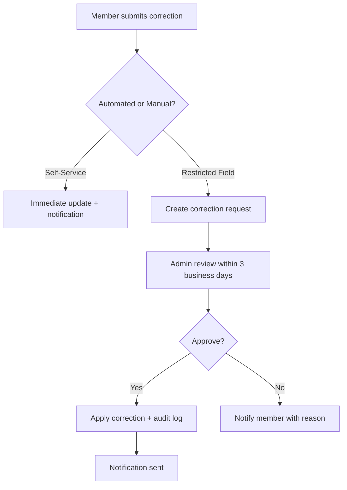
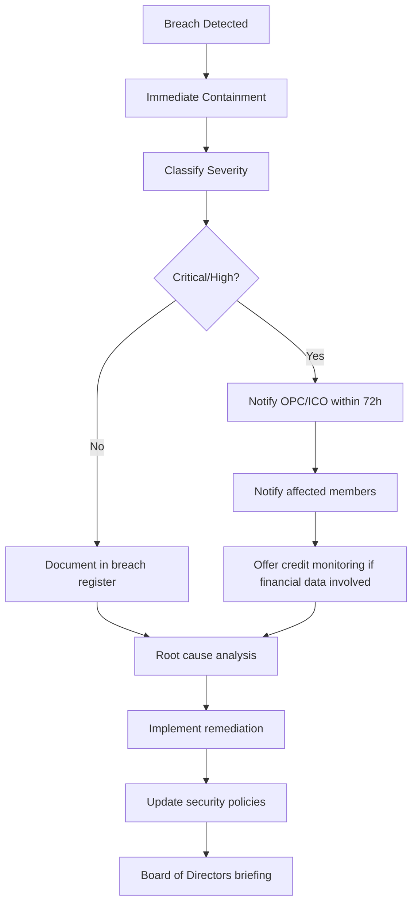

# Data Governance Framework

**Version:** 1.0  
**Effective Date:** February 14, 2026  
**Last Updated:** February 14, 2026  
**Document Owner:** Chief Privacy Officer / Data Protection Officer  
**Review Cycle:** Annual (or upon regulatory change)  
**Compliance Scope:** GDPR, PIPEDA, CCPA, CPRA, LMRDA, SOC 2, ISO 27001  

---

## Executive Summary

This Data Governance Framework establishes comprehensive policies for managing the lifecycle of union member data within the Union Eyes platform. It ensures compliance with international privacy regulations (GDPR, PIPEDA), protects member privacy rights, and maintains audit trails required for union financial transparency (LMRDA).

**Key Commitments:**
- **Right to be Forgotten:** Members can request complete erasure within 30 days
- **Data Minimization:** Collect only data necessary for union operations
- **Retention Limits:** Automatic purge of non-essential data after defined periods
- **Audit Readiness:** Immutable audit logs retained for 7 years (LMRDA compliance)
- **Cross-Border Controls:** Legal basis validation for international data transfers

**Regulatory Alignment:**
- **GDPR (Articles 5, 15-22, 30):** Lawful processing, data subject rights, accountability
- **PIPEDA (Principles 4.1-4.9):** Consent, limits on use, safeguards
- **CCPA/CPRA (§1798.100-130):** Consumer rights, opt-out mechanisms
- **LMRDA (§201-211):** Financial records retention, member access rights
- **SOC 2 (CC6.1, CC6.7):** Data security, disposal practices

---

## 1. Data Classification Scheme

### 1.1 Classification Levels

| Classification | Definition | Examples | Retention | Encryption |
|----------------|------------|----------|-----------|------------|
| **Critical PII** | Identifies individual + financial/medical data | SIN, SSN, Health Records, Payment Cards | 7 years (tax/legal) | AES-256 at rest + in transit |
| **Standard PII** | Personal identifiers without financial context | Name, Email, Phone, Address | 3 years post-termination | TLS 1.3 in transit, encrypted at rest |
| **Sensitive Union Data** | Voting records, grievances, disciplinary actions | Election ballots, Claims, Suspensions | 7 years (LMRDA) | Encrypted + access logging |
| **Financial Records** | Dues, payments, transactions | Stripe transactions, Dues history | 7 years (CRA/IRS) | Encrypted + SOC 2 compliance |
| **Operational Data** | Non-identifying system metadata | Session logs, API metrics, Error logs | 90 days | TLS in transit |
| **Public Data** | Published union information | CBA summaries, Public announcements | Indefinite | Standard HTTPS |

### 1.2 Data Subject Rights by Classification

| Right | Critical PII | Standard PII | Sensitive Union Data | Financial Records | Operational Data |
|-------|--------------|--------------|----------------------|-------------------|------------------|
| **Access** | Yes (30 days) | Yes (30 days) | Yes (30 days) | Yes (30 days) | Aggregated only |
| **Rectification** | Yes (immediate) | Yes (immediate) | Yes (with audit trail) | No (immutable for audit) | No |
| **Erasure** | Yes (with exceptions) | Yes (after retention) | Legal hold override | No (7-year retention) | Automatic purge |
| **Portability** | Yes (JSON/CSV) | Yes (JSON/CSV) | Yes (redacted) | Yes (with audit notice) | No |
| **Objection** | Yes (stops processing) | Yes (stops processing) | Limited (union duty context) | No (legal obligation) | No |

---

## 2. Data Retention Policies

### 2.1 Retention Schedule

```yaml
retention_policies:
  member_profiles:
    active_membership: "Retain indefinitely while active"
    post_termination: "3 years after last membership payment"
    exceptions:
      legal_hold: "Indefinite until hold lifted"
      ongoing_litigation: "Until case resolution + 1 year"
    purge_trigger: "Automated monthly job (1st of month)"
  
  financial_records:
    dues_payments: "7 years from transaction date"
    stripe_transactions: "10 years (align with Stripe retention)"
    tax_documents: "7 years (CRA/IRS requirement)"
    audit_trails: "7 years (LMRDA §206)"
    purge_trigger: "Annual review (January 15)"
  
  voting_records:
    election_results: "7 years (LMRDA transparency)"
    individual_ballots: "2 years (dispute resolution period)"
    ballot_encryption_keys: "Destroy 30 days post-election"
    purge_trigger: "Automated (election close + 2 years)"
  
  claims_grievances:
    active_claims: "Retain until resolution + 3 years"
    resolved_claims: "7 years post-resolution"
    supporting_documents: "Same as parent claim"
    purge_trigger: "Quarterly review (claims older than threshold)"
  
  communication_logs:
    notification_history: "1 year"
    email_delivery_logs: "90 days"
    sms_records: "90 days (Twilio retention)"
    push_notification_logs: "30 days"
    purge_trigger: "Automated weekly (Sundays at 02:00 UTC)"
  
  session_activity:
    authentication_logs: "1 year (security investigations)"
    api_request_logs: "90 days (debugging/performance)"
    error_logs: "180 days (incident response)"
    audit_logs: "7 years (compliance)"
    purge_trigger: "Automated daily (03:00 UTC)"
  
  document_storage:
    cba_documents: "Indefinite (legal reference)"
    member_uploads: "Tied to parent entity retention"
    system_generated_pdfs: "90 days (regenerable content)"
    purge_trigger: "Monthly (unused attachments)"
```

### 2.2 Retention Calculation Examples

**Scenario 1: Standard Member Termination**
- Member last payment: **January 15, 2023**
- Active grace period: **3 months** (account active until April 15, 2023)
- Retention period: **3 years post-grace** (purge April 15, 2026)
- Final purge date: **May 1, 2026** (next monthly purge job)

**Scenario 2: Member with Ongoing Claim**
- Member terminated: **June 1, 2023**
- Active claim filed: **May 15, 2023**
- Claim resolved: **December 10, 2024**
- Claim retention: **7 years** (purge December 10, 2031)
- Member profile retention: **Extended to December 10, 2031** (linked to claim)

**Scenario 3: Legal Hold**
- Member terminates: **March 1, 2024**
- Legal hold placed: **August 1, 2024** (litigation)
- Normal purge date: **March 1, 2027** (3 years post-termination)
- Legal hold lifted: **January 15, 2026**
- Actual purge date: **February 1, 2027** (1 year post-hold + next purge cycle)

---

## 3. Data Subject Rights (DSR) Procedures

### 3.1 Right to Access (GDPR Art. 15, PIPEDA Principle 4.9)

**Request Channels:**
- Web portal: `/dashboard/privacy/data-access`
- Email: `privacy@unioneyes.com`
- Postal mail: Privacy Officer, Union Eyes, [Address]

**Response Timeline:**
- Acknowledgment: **72 hours**
- Delivery: **30 days** (GDPR/PIPEDA compliant)
- Extensions: **Up to 60 days additional** (with justification)

**Deliverable Format:**
```json
{
  "request_id": "DSR-2026-001234",
  "requested_date": "2026-02-14T10:30:00Z",
  "member_id": "mbr_abc123",
  "data_package": {
    "profile_data": {
      "personal_info": { ... },
      "contact_info": { ... },
      "membership_history": [ ... ]
    },
    "activity_data": {
      "voting_history": [ ... ],
      "claims_filed": [ ... ],
      "financial_transactions": [ ... ]
    },
    "system_data": {
      "login_history": [ ... ],
      "consent_records": [ ... ]
    }
  },
  "excluded_data": [
    {
      "category": "other_members_pii",
      "reason": "Third-party privacy protection (GDPR Art. 15(4))"
    },
    {
      "category": "fraud_investigation_notes",
      "reason": "Legitimate interest exemption (GDPR Art. 6(1)(f))"
    }
  ],
  "export_format": "JSON",
  "encryption": "PGP_PUBLIC_KEY",
  "delivery_method": "secure_download_link"
}
```

**Exclusions (GDPR Art. 15(4)):**
- Information revealing other members' identities (redacted)
- Legal privilege communications (attorney work product)
- Active fraud/security investigations (until closed)

---

### 3.2 Right to Rectification (GDPR Art. 16, PIPEDA Principle 4.6)

**Eligible Fields:**
- Name, email, phone, address (immediate update)
- Emergency contact information (immediate)
- Communication preferences (immediate)

**Restricted Fields (Audit Trail Required):**
- Historical financial records (append correction, retain original)
- Voting records (immutable, dispute resolution only)
- Claim documents (versioning required)

**Rectification Process:**


---

### 3.3 Right to Erasure / "Right to be Forgotten" (GDPR Art. 17, PIPEDA Principle 4.3.8)

**Erasure Request Workflow:**

```typescript
// Pseudocode implementation
async function processErasureRequest(memberId: string, requestDetails: ErasureRequest) {
  // Step 1: Validate request eligibility
  const legalHolds = await checkLegalHolds(memberId);
  if (legalHolds.length > 0) {
    return {
      status: "DENIED",
      reason: "Legal hold active (litigation pending)",
      hold_ids: legalHolds
    };
  }

  // Step 2: Check retention obligations
  const retentionChecks = await evaluateRetentionRequirements(memberId);
  if (retentionChecks.mustRetain.length > 0) {
    return {
      status: "PARTIAL",
      reason: "Some data subject to legal retention (LMRDA, tax law)",
      retained_categories: retentionChecks.mustRetain,
      erasable_categories: retentionChecks.canErase
    };
  }

  // Step 3: Execute erasure
  const erasureLog = {
    request_id: generateRequestId(),
    timestamp: new Date(),
    member_id: memberId,
    requested_by: requestDetails.requestor,
    data_deleted: []
  };

  // Soft-delete member profile (retain audit trail)
  await softDeleteMemberProfile(memberId);
  erasureLog.data_deleted.push("member_profile");

  // Hard-delete non-essential data
  await hardDeleteSessions(memberId);
  await hardDeleteNotifications(memberId);
  await hardDeleteCachedData(memberId);
  erasureLog.data_deleted.push("sessions", "notifications", "cache");

  // Pseudonymize retained data (GDPR Art. 17(3)(b) exemption)
  await pseudonymizeFinancialRecords(memberId);
  await pseudonymizeAuditLogs(memberId);
  erasureLog.data_deleted.push("pseudonymized_financial", "pseudonymized_audit");

  // Step 4: Cascade deletions
  await deleteOrphanedDocuments(memberId);
  await revokeApiKeys(memberId);

  // Step 5: Record immutable audit trail
  await recordErasureAudit(erasureLog);

  return {
    status: "COMPLETED",
    request_id: erasureLog.request_id,
    completion_date: erasureLog.timestamp,
    deleted_categories: erasureLog.data_deleted
  };
}
```

**Erasure Exemptions (GDPR Art. 17(3), PIPEDA Schedule 1 4.5):**
- **Legal Compliance:** Financial records retained 7 years (tax/LMRDA)
- **Legal Claims:** Data involved in ongoing litigation (until resolution)
- **Public Interest:** Published union transparency data (anonymized)
- **Archiving:** Historical union election data (pseudonymized)

**Post-Erasure State:**
- Member ID converted to cryptographic hash (irreversible)
- Financial audit trail: Replaced with "MEMBER_REDACTED" + transaction metadata
- Access logs: Replaced with pseudonymous identifier

---

### 3.4 Right to Data Portability (GDPR Art. 20)

**Export Formats:**
- JSON (default, structured data)
- CSV (tabular data: dues, transactions)
- PDF (human-readable summary)

**Included Data:**
- Member-provided information (registration, profile updates)
- System-generated data (transaction history, voting records)
- Preference/consent history

**Excluded Data:**
- Derived/inferred data (e.g., ML predictions)
- System-internal metadata (server logs, IP addresses)

**API Endpoint:**
```http
POST /api/v1/data-subject-requests/export
Authorization: Bearer {member_token}
Content-Type: application/json

{
  "format": "json",
  "categories": ["profile", "financial", "voting"],
  "encryption": {
    "method": "pgp",
    "public_key": "-----BEGIN PGP PUBLIC KEY BLOCK-----..."
  }
}
```

---

### 3.5 Right to Object (GDPR Art. 21)

**Objection Scenarios:**

| Processing Activity | Objection Allowed? | Effect |
|---------------------|-------------------|--------|
| Marketing emails | ✅ Yes | Immediate opt-out |
| Profiling for analytics | ✅ Yes | Exclude from aggregation |
| Mandatory union communications | ❌ No | Union governance obligation |
| Dues processing | ❌ No | Contract obligation (membership) |
| Fraud prevention | ❌ No | Legitimate interest (GDPR Art. 6(1)(f)) |

---

## 4. Legal Hold Management

### 4.1 Legal Hold Triggers

**Activation Criteria:**
- Litigation filed against union (employment disputes, contract claims)
- Regulatory investigation (Ministry of Labour, IRS, CRA)
- Internal investigation (fraud, misconduct)
- Arbitration proceedings (grievance escalation)

**Notification Process:**
```yaml
legal_hold_workflow:
  step_1_initiation:
    trigger: "Legal counsel or executive officer"
    required_approvals: ["General Counsel", "Union President"]
    documentation: "Legal Hold Notice (LHN) document"
  
  step_2_scope_definition:
    custodians: ["Members involved", "Stewards", "Union officers"]
    date_range: "Typically 2 years prior to incident"
    data_types: ["Emails", "Claims", "Financial records", "Communication logs"]
  
  step_3_system_implementation:
    action: "Flag affected records in database"
    sql_example: |
      UPDATE members
      SET legal_hold_flag = TRUE, legal_hold_case_id = 'LH-2026-001'
      WHERE member_id IN (SELECT member_id FROM legal_hold_custodians WHERE case_id = 'LH-2026-001');
  
  step_4_monitoring:
    frequency: "Quarterly review"
    owner: "Legal team + Data Protection Officer"
  
  step_5_release:
    trigger: "Case closure + statute of limitations expiry"
    approval: "General Counsel sign-off"
    action: "Remove flags + resume normal retention policies"
```

### 4.2 Legal Hold Impact on DSR Requests

**Access Requests:** ✅ Granted (member can still view their data)  
**Rectification:** ❌ Denied (preserve evidence integrity)  
**Erasure:** ❌ Denied (legal obligation to retain)  
**Portability:** ✅ Granted (export copy provided, original retained)  

**Member Communication Template:**
```
Subject: Data Subject Request - Legal Hold Notification

Dear [Member Name],

We received your request to [delete/modify] your personal data dated [Request Date].

We must inform you that your data is currently subject to a legal hold due to [litigation/investigation/arbitration] case [Case ID]. Under [GDPR Art. 17(3)(e) / PIPEDA / CCPA §1798.145(a)(2)], we are legally obligated to retain this data until the matter is resolved.

Current status: [Active litigation / Under investigation]
Expected resolution: [Estimated date or "Unknown"]
Data categories affected: [Financial records / Communications / Claims]

Your other data rights remain unaffected:
- ✅ You can still access your data
- ✅ You can export a copy of your data
- ❌ Deletion/modification requests will be queued until legal hold is lifted

If you have questions or wish to challenge this hold, please contact:
Legal Department: legal@unioneyes.com
Privacy Officer: privacy@unioneyes.com

Reference: Legal Hold Case #[Case ID]
```

---

## 5. Archival and Long-Term Storage

### 5.1 Archival Policy

**Transition to Archive:**
- **Trigger:** Data retention period expires but legal/historical value remains
- **Storage Tier:** Cold storage (Azure Cool/Archive Blob, AWS S3 Glacier)
- **Access Pattern:** Infrequent retrieval (audit requests, historical research)
- **Cost Optimization:** 80% storage cost reduction vs. hot storage

**Archival Schedule:**
```yaml
archival_rules:
  financial_audit_records:
    hot_storage: "Current year + 2 years"
    warm_storage: "Years 3-5"
    cold_storage: "Years 6-7"
    purge: "After 7 years (unless legal hold)"
  
  election_historical_data:
    hot_storage: "Election year + 1 year"
    cold_storage: "Years 2-7"
    permanent_archive: "Anonymized aggregate results (indefinite)"
  
  cba_versions:
    hot_storage: "Current CBA + 1 prior version"
    warm_storage: "Last 5 CBA versions"
    cold_storage: "Historical CBAs (indefinite for legal precedent)"
```

### 5.2 Archive Retrieval Process

**SLA Targets:**
- **Hot Storage:** < 100ms retrieval
- **Warm Storage:** < 1 hour retrieval
- **Cold Storage:** < 24 hours retrieval (Glacier Deep Archive)

**Request Types:**
- Audit request (regulatory compliance)
- Legal discovery (litigation)
- Historical research (union leadership)
- Member access request (DSR)

---

## 6. Cross-Border Data Transfers

### 6.1 Geographic Data Residency

**Current Architecture:**
```yaml
primary_region: "Canada (Toronto)" # PIPEDA compliant
secondary_region: "USA (East)" # Transborder data flow
disaster_recovery: "Canada (Montreal)" # Failover

data_localization_rules:
  canadian_members:
    storage: "Canada-only (PIPEDA §4.1.5)"
    processing: "Canada or USA (adequacy decision)"
    exceptions: "EU members - GDPR SCC required"
  
  us_members:
    storage: "USA or Canada"
    processing: "North America"
    exceptions: "None"
  
  eu_members:
    storage: "EU or Canada (adequacy decision)"
    processing: "Transfer Impact Assessment required"
    legal_basis: "Standard Contractual Clauses (SCC)"
```

### 6.2 GDPR Compliance for EU Members

**Legal Basis for Transfer (GDPR Art. 46):**
- **Option 1:** EU-Canada Adequacy Decision (European Commission)
- **Option 2:** Standard Contractual Clauses (SCC 2021 version)
- **Option 3:** Binding Corporate Rules (BCR) - if multi-national union

**Transfer Impact Assessment (TIA):**
```markdown
### TIA for Canada → USA Data Transfers

**Legal Framework:** CLOUD Act (USA), PIPEDA (Canada)

**Risk Assessment:**
- **US Government Access:** FISA §702 surveillance risk (minimal - union data not national security)
- **Mitigations:** Encryption at rest + in transit, data minimization
- **Member Notification:** Privacy policy disclosure of US processing
- **Alternative Safeguards:** Contractual commitments with US cloud provider

**Conclusion:** Transfer permitted under SCC + supplementary measures (encryption)
```

### 6.3 Data Sovereignty for Indigenous Unions

**Special Considerations:**
- **OCAP® Principles (Canada):** Ownership, Control, Access, Possession
- **Tribal Sovereignty (USA):** Consultation with tribal authorities
- **Data Residency:** Prefer on-reserve servers or Canadian data centers
- **Consent Requirements:** Enhanced notice for transborder flows

**Implementation:**
```typescript
// Flag Indigenous-governed data
interface IndigenousMemberData {
  member_id: string;
  nation_affiliation: string;
  data_sovereignty_flag: true;
  storage_preference: "on_premise" | "canadian_only" | "tribal_cloud";
  transfer_consent: {
    international: boolean;
    us_transfer: boolean;
    tribal_governance: boolean;
  };
}

// Enforce residency rules
async function storeIndigenousData(data: IndigenousMemberData) {
  if (data.storage_preference === "canadian_only") {
    await enforceCanadianStorage(data);
  }
  // Additional sovereignty checks...
}
```

---

## 7. Audit and Compliance Reporting

### 7.1 Internal Audit Schedule

| Audit Type | Frequency | Scope | Owner |
|------------|-----------|-------|-------|
| Data Access Audit | Monthly | Review admin/privileged access logs | Security Team |
| Retention Policy Compliance | Quarterly | Verify automated purges executed | Data Protection Officer |
| DSR Response Time | Quarterly | Measure 30-day SLA compliance | Privacy Team |
| Legal Hold Review | Quarterly | Validate active holds necessity | General Counsel |
| Cross-Border Transfer Audit | Semi-Annual | Review TIA for new jurisdictions | Privacy + Legal |
| SOC 2 Type II Readiness | Annual | Full data lifecycle audit | External Auditor |

### 7.2 Regulatory Reporting Obligations

**LMRDA Annual Report (LM-2 Filing):**
- **Deadline:** March 31 (fiscal year end December 31)
- **Data Requirements:** Financial transactions, officer compensation, asset inventory
- **Retention Proof:** Demonstrate 7-year retention of supporting documents
- **Union Eyes Export:** `/api/compliance/lm2-export?year=2025`

**PIPEDA Breach Notification:**
- **Threshold:** Real risk of significant harm
- **Timeline:** ASAP (OPC expects 72 hours)
- **Recipients:** Affected individuals + Office of the Privacy Commissioner
- **Records:** Maintain breach register (PIPEDA §10.1)

**GDPR Article 30 Records of Processing Activities (ROPA):**
```yaml
ropa_entry_example:
  processing_activity: "Member Profile Management"
  legal_basis: "Contract (GDPR Art. 6(1)(b))"
  data_categories: ["Name", "Email", "Membership status"]
  recipients: ["Union officers", "Stewards", "Payment processors"]
  retention: "3 years post-termination"
  security_measures: "Encryption, RLS, MFA"
  dpo_contact: "privacy@unioneyes.com"
```

### 7.3 Audit Trail Requirements

**Immutable Logs (SOC 2 CC6.1):**
- **Duration:** 7 years (align with financial retention)
- **Events Logged:**
  - Admin access to member PII
  - Data exports (DSR, compliance reports)
  - Retention policy changes
  - Legal hold activations/releases
  - Cross-border data transfers
- **Storage:** Write-once, tamper-proof (append-only database or blockchain)

**Log Example:**
```json
{
  "event_id": "evt_2026_02_14_001234",
  "timestamp": "2026-02-14T15:30:00Z",
  "event_type": "MEMBER_DATA_EXPORT",
  "actor": {
    "user_id": "admin_001",
    "role": "Union Officer",
    "ip_address": "192.168.1.100",
    "session_id": "sess_xyz"
  },
  "subject": {
    "member_id": "mbr_abc123",
    "data_classification": "Standard PII"
  },
  "action": {
    "operation": "EXPORT_MEMBER_PROFILE",
    "reason": "DSR Access Request #DSR-2026-001234",
    "data_exported": ["profile", "financial_summary", "voting_history"],
    "export_format": "JSON",
    "encryption": "PGP"
  },
  "compliance_metadata": {
    "legal_basis": "GDPR Art. 15",
    "retention_category": "audit_log",
    "retention_expiry": "2033-02-14"
  },
  "hash": "sha256:abc123...",
  "previous_hash": "sha256:def456..."
}
```

---

## 8. Data Breach Response Plan

### 8.1 Breach Classification

**Severity Levels:**
| Level | Definition | Examples | Notification Required |
|-------|------------|----------|----------------------|
| **Critical** | Mass exposure of Critical PII | SIN database leak, Payment card breach | Yes (72h PIPEDA, 72h GDPR) |
| **High** | Standard PII breach affecting >100 members | Email list exfiltration, Login credential leak | Yes |
| **Medium** | Limited PII exposure OR operational data | Single member record accessed, Session hijack | Case-by-case |
| **Low** | No PII involved | Public CBA document accessed, Anonymous analytics leak | No |

### 8.2 Breach Response Workflow



### 8.3 Member Notification Template

```markdown
Subject: Important Security Notice - Data Breach Notification

Dear [Member Name],

We are writing to inform you of a data security incident that may have affected your personal information held by Union Eyes.

**What Happened:**
On [Date], we discovered that [brief description of breach]. We immediately took steps to contain the incident and engaged cybersecurity experts to investigate.

**What Information Was Affected:**
- [List specific data types: Name, Email, SIN, etc.]
- [Number of members affected]

**What We Are Doing:**
- Secured the vulnerability
- Notified law enforcement and regulators
- Enhanced security monitoring

**What You Should Do:**
1. Monitor your accounts for suspicious activity
2. Enable multi-factor authentication (MFA) on your Union Eyes account
3. [If applicable] Enroll in free credit monitoring: [link]

**More Information:**
- FAQ: [Website link]
- Contact: privacy@unioneyes.com / 1-800-XXX-XXXX
- Reference: Incident #[INC-2026-001]

We deeply apologize for this incident and are committed to protecting your information.

Sincerely,
[Union President]
[Data Protection Officer]
```

---

## 9. Implementation Roadmap

### Phase 1: Foundation (Months 1-3)
- [ ] Appoint Data Protection Officer (DPO)
- [ ] Conduct data mapping exercise (GDPR Art. 30 ROPA)
- [ ] Implement automated retention purge jobs
- [ ] Create DSR request portal (`/dashboard/privacy`)
- [ ] Draft legal hold procedures

**Deliverables:**
- Data inventory spreadsheet
- Retention schedule database table
- DSR ticketing system
- Legal hold flag in database schema

### Phase 2: Automation (Months 4-6)
- [ ] Build automated erasure pipeline (pseudonymization scripts)
- [ ] Implement audit logging for all data access
- [ ] Deploy data classification tags in database
- [ ] Set up cross-border transfer controls (geofencing)
- [ ] Create breach response runbook

**Deliverables:**
- Erasure automation tested (dry-run mode)
- Immutable audit log system
- Data residency enforcement logic
- Incident response playbook

### Phase 3: Compliance (Months 7-9)
- [ ] Conduct Transfer Impact Assessment (TIA) for US/EU transfers
- [ ] Perform SOC 2 readiness audit
- [ ] Train union officers on DSR handling
- [ ] Establish quarterly compliance reporting
- [ ] Engage external privacy counsel for review

**Deliverables:**
- TIA report (GDPR Art. 46)
- SOC 2 audit report
- Officer training completion certificates
- Quarterly compliance dashboard

### Phase 4: Continuous Improvement (Ongoing)
- [ ] Annual privacy policy review
- [ ] Quarterly retention policy audits
- [ ] Monthly DSR SLA monitoring
- [ ] Regulatory horizon scanning (new privacy laws)
- [ ] Member privacy education campaigns

---

## 10. Roles and Responsibilities

### Data Protection Officer (DPO)
- **Primary Duties:**
  - Oversee DSR request fulfillment
  - Monitor compliance with GDPR/PIPEDA
  - Conduct Data Protection Impact Assessments (DPIA)
  - Liaison with regulatory authorities (OPC, ICO)
- **Contact:** privacy@unioneyes.com
- **Reporting Line:** Union Executive Board + General Counsel

### General Counsel
- **Primary Duties:**
  - Approve legal hold requests
  - Review cross-border transfer agreements
  - Provide legal basis opinions for data processing
  - Negotiate Data Processing Agreements (DPA) with vendors

### IT Security Team
- **Primary Duties:**
  - Implement technical data protection measures
  - Execute retention purge jobs
  - Monitor audit logs for unauthorized access
  - Respond to security incidents

### Union Officers (Stewards, Executives)
- **Primary Duties:**
  - Handle member privacy inquiries
  - Escalate DSR requests to DPO
  - Respect member data access controls
  - Complete annual privacy training

---

## 11. Glossary

| Term | Definition |
|------|------------|
| **Data Subject** | Individual whose personal data is processed (union member) |
| **Data Controller** | Entity determining purposes of data processing (Union Eyes) |
| **Data Processor** | Entity processing data on controller's behalf (cloud providers) |
| **PII** | Personally Identifiable Information (name, email, SIN, etc.) |
| **Pseudonymization** | Replacing identifiers with pseudonyms (reversible with key) |
| **Anonymization** | Irreversible removal of identifiers (cannot re-identify) |
| **Legal Hold** | Preservation of data for litigation/investigation |
| **DSR** | Data Subject Request (access, rectification, erasure, etc.) |
| **ROPA** | Records of Processing Activities (GDPR Art. 30) |
| **TIA** | Transfer Impact Assessment (GDPR Art. 46) |
| **DPA** | Data Processing Agreement (vendor contract) |
| **DPIA** | Data Protection Impact Assessment (high-risk processing) |

---

## 12. Related Documents

- [STRIDE Threat Model](../security/STRIDE_THREAT_MODEL.md) - Security risk analysis
- [RBAC Authority Matrix](../security/RBAC_AUTHORITY_MATRIX.md) - Access control policies
- [SLA & Error Budget Policy](../operations/SLA_ERROR_BUDGET_POLICY.md) - Service reliability
- [Privacy Policy (Member-Facing)](../legal/PRIVACY_POLICY.md) - External disclosure
- [Incident Response Plan](../security/INCIDENT_RESPONSE_PLAN.md) - Security breach procedures
- [Vendor Security Questionnaire](../procurement/VENDOR_SECURITY_ASSESSMENT.md) - Third-party due diligence

---

## 13. Document Control

| Version | Date | Author | Changes |
|---------|------|--------|---------|
| 1.0 | 2026-02-14 | Data Protection Officer | Initial framework creation |

**Next Review Date:** February 14, 2027  
**Approval Authority:** Union Executive Board + General Counsel  

**Revision Triggers:**
- New privacy legislation enacted (GDPR amendments, provincial laws)
- Major data breach incident
- SOC 2 / ISO 27001 audit findings
- Change in union governance structure

**Distribution:**
- Union Executive Board (mandatory review)
- IT Security Team (operational implementation)
- General Counsel (legal compliance)
- All union officers with data access (training)

---

## Appendix A: SQL Purge Job Examples

```sql
-- Monthly purge: Inactive members (3 years post-termination)
DELETE FROM members
WHERE status = 'terminated'
  AND last_payment_date < NOW() - INTERVAL '3 years'
  AND NOT EXISTS (
    SELECT 1 FROM legal_holds WHERE member_id = members.id
  );

-- Quarterly purge: Old notification logs
DELETE FROM notification_logs
WHERE created_at < NOW() - INTERVAL '90 days';

-- Annual purge: Obsolete financial records (7 years)
UPDATE financial_transactions
SET member_id = NULL, -- Pseudonymize
    member_name = 'REDACTED',
    notes = 'Archived per retention policy'
WHERE transaction_date < NOW() - INTERVAL '7 years';
```

## Appendix B: DSR Request Form

**Data Subject Request Form**

- [ ] Access (receive copy of my data)
- [ ] Rectification (correct inaccurate data)
- [ ] Erasure ("right to be forgotten")
- [ ] Portability (export my data)
- [ ] Object (stop processing for specific purpose)
- [ ] Restrict Processing (limit use of my data)

**Member Information:**
- Full Name: ___________________
- Member ID: ___________________
- Email: ___________________
- Phone: ___________________
- Preferred Contact Method: ___________________

**Request Details:**
- Data Categories Requested: ___________________
- Reason for Request: ___________________
- Preferred Delivery Method: ___________________

**Identity Verification:**
- Last 4 digits of SIN/SSN: ___________________
- Date of Birth: ___________________
- Security Question Answer: ___________________

**Declaration:**
I certify that I am the data subject or authorized representative.

Signature: ___________________ Date: ___________________

**For DPO Use Only:**
- Request ID: ___________________
- Received Date: ___________________
- Response Deadline: ___________________
- Status: ___________________

---

**END OF DOCUMENT**
