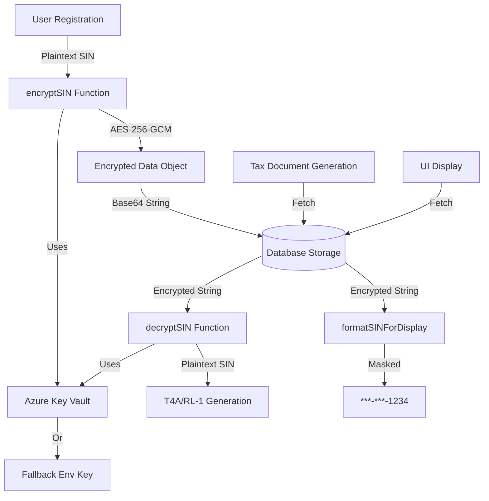

# 🔐 Encryption System Guide - Union Eyes

## Overview

This guide covers the encryption system for protecting Personally Identifiable Information (PII) in Union Eyes, with a focus on **Social Insurance Numbers (SIN)**, **Social Security Numbers (SSN)**, and **bank account details**.

**Status**: ✅ Fully Implemented  
**Last Updated**: 2026-02-06  
**Compliance**: PIPEDA, GDPR, SOC 2, CRA Requirements

---

## 📋 Table of Contents

1. [Architecture](#architecture)
2. [Azure Key Vault Integration](#azure-key-vault-integration)
3. [Usage Guide](#usage-guide)
4. [Database Schema](#database-schema)
5. [Tax Document Generation](#tax-document-generation)
6. [Environment Configuration](#environment-configuration)
7. [Key Rotation](#key-rotation)
8. [Testing](#testing)
9. [Troubleshooting](#troubleshooting)
10. [Security Best Practices](#security-best-practices)

---

## Architecture

### Encryption Flow



### Components

1. **lib/encryption.ts**: Core encryption service with Azure Key Vault integration
2. **db/schema/users-schema.ts**: Database schema with encrypted PII fields
3. **lib/services/strike-fund-tax-service.ts**: Tax document generation with decryption
4. **lib/env-validator.ts**: Validates encryption environment variables

---

## Azure Key Vault Integration

### Prerequisites

1. **Azure Key Vault** instance
2. **Azure AD application** with Key Vault permissions
3. **Managed Identity** or **Service Principal** credentials

### Setup Steps

#### 1. Create Azure Key Vault

```bash
# Create resource group
az group create --name unioneyes-rg --location canadacentral

# Create Key Vault
az keyvault create \
  --name unioneyes-keyvault \
  --resource-group unioneyes-rg \
  --location canadacentral \
  --enable-purge-protection \
  --retention-days 90

# Create encryption key
az keyvault key create \
  --vault-name unioneyes-keyvault \
  --name pii-encryption-key \
  --kty RSA \
  --size 2048 \
  --ops encrypt decrypt
```

#### 2. Configure Azure AD Application

```bash
# Create service principal
az ad sp create-for-rbac \
  --name unioneyes-app \
  --role "Key Vault Crypto User" \
  --scopes /subscriptions/{subscription-id}/resourceGroups/unioneyes-rg/providers/Microsoft.KeyVault/vaults/unioneyes-keyvault
```

**Save the output:**

- `appId` → `AZURE_CLIENT_ID`
- `password` → `AZURE_CLIENT_SECRET`
- `tenant` → `AZURE_TENANT_ID`

#### 3. Grant Permissions

```bash
# Grant Key Vault permissions
az keyvault set-policy \
  --name unioneyes-keyvault \
  --spn {AZURE_CLIENT_ID} \
  --key-permissions get list encrypt decrypt
```

#### 4. Environment Variables

Add to `.env.local`:

```bash
# Azure Key Vault Configuration
AZURE_KEY_VAULT_URL=https://unioneyes-keyvault.vault.azure.net/
AZURE_CLIENT_ID=your-client-id
AZURE_CLIENT_SECRET=your-client-secret
AZURE_TENANT_ID=your-tenant-id
ENCRYPTION_KEY_NAME=pii-encryption-key
```

---

## Usage Guide

### Encrypting SIN on Registration

```typescript
// actions/members-actions.ts
'use server';

import { encryptSIN } from '@/lib/encryption';
import { db } from '@/db';
import { users } from '@/db/schema';

export async function registerMember(data: {
  email: string;
  sin: string;
  // ...other fields
}) {
  // Validate SIN format (9 digits)
  if (!/^\d{3}-?\d{3}-?\d{3}$/.test(data.sin)) {
    throw new Error('Invalid SIN format');
  }

  // Encrypt SIN before storage
  const encryptedSin = await encryptSIN(data.sin);

  // Store in database
  const member = await db.insert(users).values({
    email: data.email,
    encryptedSin: encryptedSin,
    // ...other fields
  }).returning();

  return member;
}
```

### Decrypting SIN for Tax Documents

```typescript
// lib/services/strike-fund-tax-service.ts
import { decryptSIN } from '@/lib/encryption';
import { db } from '@/db';
import { users } from '@/db/schema';

export async function generateT4A(
  memberId: string,
  taxYear: number
): Promise<T4ASlip> {
  // Fetch member with encrypted SIN
  const member = await db.query.users.findFirst({
    where: eq(users.userId, memberId)
  });

  if (!member) {
    throw new Error('Member not found');
  }

  // Decrypt SIN ONLY for official tax document generation
  // This operation is audited in logs
  let recipientSIN = 'NOT PROVIDED';
  
  if (member.encryptedSin) {
    try {
      recipientSIN = await decryptSIN(member.encryptedSin);
      
      // Audit log for compliance
      logger.info('SIN decrypted for T4A generation', {
        memberId,
        taxYear,
        action: 't4a_generation',
      });
    } catch (error) {
      logger.error('Failed to decrypt SIN for T4A generation', error);
      throw new Error('Unable to decrypt member SIN');
    }
  }

  // Generate T4A with decrypted SIN
  return {
    slipType: 'T4A',
    taxYear,
    recipientSIN: recipientSIN,
    // ...other fields
  };
}
```

### Displaying Masked SIN in UI

```typescript
// components/member-details.tsx
import { formatSINForDisplay } from '@/lib/encryption';

export async function MemberDetails({ memberId }: { memberId: string }) {
  const member = await db.query.users.findFirst({
    where: eq(users.userId, memberId)
  });

  // Show only last 4 digits
  const maskedSIN = await formatSINForDisplay(
    member.encryptedSin || '',
    true // encrypted = true
  );

  return (
    <div>
      <p>SIN: {maskedSIN}</p> {/* ***-***-1234 */}
    </div>
  );
}
```

### Migrating Plaintext to Encrypted

```typescript
// scripts/migrate-sin-encryption.ts
import { migrateSINToEncrypted } from '@/lib/encryption';
import { db } from '@/db';
import { users } from '@/db/schema';

export async function migrateAllSINs() {
  const members = await db.select().from(users);

  for (const member of members) {
    if (member.sin && !member.encryptedSin) {
      // Migrate plaintext SIN to encrypted
      const encrypted = await migrateSINToEncrypted(member.sin);
      
      await db.update(users)
        .set({ encryptedSin: encrypted, sin: null })
        .where(eq(users.userId, member.userId));
}
  }
}
```

---

## Database Schema

### Users Table with Encrypted Fields

```typescript
// db/schema/users-schema.ts
export const users = userManagementSchema.table("users", {
  userId: uuid("user_id").primaryKey().defaultRandom(),
  email: varchar("email", { length: 255 }).notNull().unique(),
  
  // ... other fields
  
  // Encrypted PII fields (added for tax compliance)
  encryptedSin: text("encrypted_sin"),        // Social Insurance Number (Canada)
  encryptedSsn: text("encrypted_ssn"),        // Social Security Number (USA)
  encryptedBankAccount: text("encrypted_bank_account"), // Bank account details
  
  createdAt: timestamp("created_at").defaultNow(),
  updatedAt: timestamp("updated_at").defaultNow(),
});
```

### Migration

Create migration file:

```sql
-- database/migrations/add_encrypted_pii_fields.sql

ALTER TABLE user_management.users
ADD COLUMN IF NOT EXISTS encrypted_sin TEXT,
ADD COLUMN IF NOT EXISTS encrypted_ssn TEXT,
ADD COLUMN IF NOT EXISTS encrypted_bank_account TEXT;

COMMENT ON COLUMN user_management.users.encrypted_sin IS 'Encrypted Social Insurance Number (AES-256-GCM)';
COMMENT ON COLUMN user_management.users.encrypted_ssn IS 'Encrypted Social Security Number (AES-256-GCM)';
COMMENT ON COLUMN user_management.users.encrypted_bank_account IS 'Encrypted bank account details (AES-256-GCM)';

-- Create index for encrypted SIN lookups (for audit trail)
CREATE INDEX IF NOT EXISTS idx_users_encrypted_sin 
ON user_management.users(encrypted_sin) 
WHERE encrypted_sin IS NOT NULL;
```

Run migration:

```bash
pnpm db:migrate
```

---

## Tax Document Generation

### T4A Slip (Federal Canada)

**CRA Requirements:**

- Box 028: Other Income > $500/week or $26,000/year
- **SIN required** for all T4A slips
- Deadline: February 28 following tax year

```typescript
import { generateT4A } from '@/lib/services/strike-fund-tax-service';

// Generate T4A for strike pay
const t4a = await generateT4A(memberId, 2025);
// {
//   slipType: 'T4A',
//   taxYear: 2025,
//   recipientSIN: '123456789', // DECRYPTED for CRA submission
//   box028_otherIncome: 30000,
//   // ...
// }
```

### RL-1 Slip (Quebec)

**Revenu Québec Requirements:**

- Case O: Autres revenus (Other Income)
- **NAS (NAS = SIN) required** for all RL-1 slips
- Deadline: February 28 following tax year

```typescript
import { generateRL1 } from '@/lib/services/strike-fund-tax-service';

// Generate RL-1 for Quebec members
const rl1 = await generateRL1(memberId, 2025);
// {
//   slipType: 'RL-1',
//   taxYear: 2025,
//   recipientNAS: '123456789', // DECRYPTED for Revenu Québec
//   caseO_autresRevenus: 30000,
//   // ...
// }
```

---

## Environment Configuration

### Production (Azure Key Vault)

```bash
# .env.production
AZURE_KEY_VAULT_URL=https://unioneyes-prod.vault.azure.net/
AZURE_CLIENT_ID=production-client-id
AZURE_CLIENT_SECRET=production-secret
AZURE_TENANT_ID=production-tenant-id
ENCRYPTION_KEY_NAME=pii-encryption-key
```

### Development (Fallback Key)

```bash
# .env.local
# Generate: node -e "logger.info(require('crypto').randomBytes(32).toString('base64'))"
FALLBACK_ENCRYPTION_KEY=your-base64-key-here
```

**Generate Fallback Key:**

```typescript
import { generateEncryptionKey } from '@/lib/encryption';

const key = generateEncryptionKey();
// Copy to .env.local: FALLBACK_ENCRYPTION_KEY=...
```

### Environment Validation

The `lib/env-validator.ts` validates encryption variables at startup:

```typescript
import { validateEnv } from '@/lib/env-validator';

// Called in instrumentation.ts
validateEnv();
```

**Validation Rules:**

- Production: `AZURE_KEY_VAULT_URL` recommended
- Fallback: `FALLBACK_ENCRYPTION_KEY` must be 32 bytes (base64)
- Key name: Defaults to `pii-encryption-key`

---

## Key Rotation

### Strategy

1. **Generate new key** in Azure Key Vault
2. **Keep old key active** for decryption
3. **Encrypt new data** with new key (version tracking)
4. **Re-encrypt existing data** in background
5. **Retire old key** after all data migrated

### Implementation

```typescript
// scripts/rotate-encryption-key.ts
import { encryptSIN, decryptSIN } from '@/lib/encryption';
import { db } from '@/db';
import { users } from '@/db/schema';

export async function rotateEncryptionKey(
  newKeyName: string
) {
  // Set new key name in environment
  process.env.ENCRYPTION_KEY_NAME = newKeyName;

  const members = await db.select().from(users)
    .where(sql`encrypted_sin IS NOT NULL`);

  for (const member of members) {
    // Decrypt with old key
    const plainSIN = await decryptSIN(member.encryptedSin!);
    
    // Re-encrypt with new key
    const reEncrypted = await encryptSIN(plainSIN);
    
    // Update database
    await db.update(users)
      .set({ encryptedSin: reEncrypted })
      .where(eq(users.userId, member.userId));
}
}
```

### Azure Key Vault Key Rotation

```bash
# Create new key version
az keyvault key create \
  --vault-name unioneyes-keyvault \
  --name pii-encryption-key \
  --kty RSA \
  --size 2048

# List key versions
az keyvault key list-versions \
  --vault-name unioneyes-keyvault \
  --name pii-encryption-key

# Set rotation policy (automatic)
az keyvault key set-attributes \
  --vault-name unioneyes-keyvault \
  --name pii-encryption-key \
  --policy @rotation-policy.json
```

**rotation-policy.json:**

```json
{
  "lifetimeActions": [
    {
      "trigger": {
        "timeAfterCreate": "P90D"
      },
      "action": {
        "type": "Rotate"
      }
    }
  ],
  "attributes": {
    "expiryTime": "P1Y"
  }
}
```

---

## Testing

### Unit Tests

Run encryption tests:

```bash
pnpm test __tests__/lib/encryption.test.ts
```

**Coverage:**

- ✅ SIN encryption/decryption
- ✅ Format validation
- ✅ Masked display
- ✅ Error handling
- ✅ Performance (< 50ms per operation)
- ✅ AES-256-GCM verification
- ✅ Key version tracking

### Integration Tests

```typescript
// __tests__/integration/tax-documents.test.ts
import { generateT4A } from '@/lib/services/strike-fund-tax-service';
import { encryptSIN } from '@/lib/encryption';

it('should generate T4A with decrypted SIN', async () => {
  // Create test member with encrypted SIN
  const encryptedSin = await encryptSIN('123456789');
  const member = await createTestMember({ encryptedSin });

  // Generate T4A
  const t4a = await generateT4A(member.userId, 2025);

  // Should decrypt SIN for tax document
  expect(t4a.recipientSIN).toBe('123456789');
});
```

### Manual Testing

```bash
# Test encryption/decryption
node -e "
const { encryptSIN, decryptSIN } = require('./lib/encryption');

(async () => {
  const encrypted = await encryptSIN('123456789');
const decrypted = await decryptSIN(encrypted);
})();
"
```

---

## Troubleshooting

### Common Issues

#### 1. "Cannot find module '@azure/keyvault-keys'"

**Solution:**

```bash
pnpm install -w @azure/keyvault-keys
```

#### 2. "Fallback encryption key must be 32 bytes"

**Generate Valid Key:**

```bash
node -e "logger.info(require('crypto').randomBytes(32).toString('base64'))"
```

Add to `.env.local`:

```bash
FALLBACK_ENCRYPTION_KEY=generated-key-here
```

#### 3. "Failed to decrypt SIN"

**Possible Causes:**

- Key changed (rotation without re-encryption)
- Data corrupted
- Wrong Key Vault key

**Debug:**

```typescript
import { encryptionService } from '@/lib/encryption';

// Check if data is encrypted
const isEnc = encryptionService.isEncrypted(member.encryptedSin);
// Try manual decryption
try {
  const data = JSON.parse(
    Buffer.from(member.encryptedSin, 'base64').toString('utf8')
  );
} catch (error) {
}
```

#### 4. "Azure Key Vault authentication failed"

**Check Credentials:**

```bash
# Test Azure CLI authentication
az account show

# Test Key Vault access
az keyvault key show \
  --vault-name unioneyes-keyvault \
  --name pii-encryption-key
```

**Verify Environment:**

```typescript
```

#### 5. "SIN not decrypted for T4A generation"

**Check Logs:**

```bash
# View encryption audit logs
grep "SIN decrypted" logs/application.log
grep "decrypt_sin" logs/application.log
```

**Verify Member Data:**

```sql
SELECT 
  user_id,
  email,
  encrypted_sin IS NOT NULL AS has_encrypted_sin,
  LENGTH(encrypted_sin) AS encrypted_length
FROM user_management.users
WHERE user_id = 'member-id-here';
```

---

## Security Best Practices

### Do's ✅

1. **Always encrypt SIN before storage**

   ```typescript
   const encrypted = await encryptSIN(plainSIN);
   await db.insert(users).values({ encryptedSin: encrypted });
   ```

2. **Only decrypt for official purposes**
   - Tax document generation (T4A/RL-1)
   - CRA audit requests
   - Official union business

3. **Use masked display for UI**

   ```typescript
   const masked = await formatSINForDisplay(encryptedSin, true);
   // Shows: ***-***-1234
   ```

4. **Log decryption events**

   ```typescript
   logger.info('SIN decrypted for T4A', { memberId, taxYear });
   ```

5. **Use Azure Key Vault in production**
   - Enterprise key management
   - Automatic rotation
   - Compliance audit trail

6. **Validate SIN format**

   ```typescript
   if (!/^\d{3}-?\d{3}-?\d{3}$/.test(sin)) {
     throw new Error('Invalid SIN format');
   }
   ```

### Don'ts ❌

1. **Never log plaintext SIN**

   ```typescript
   // ❌ NEVER DO THIS
   logger.info('Processing SIN', { sin: plaintextSIN });
   
   // ✅ DO THIS INSTEAD
   logger.info('Processing SIN', {
     sinHash: encryptionService.hash(plaintextSIN),
   });
   ```

2. **Never expose plaintext SIN in API**

   ```typescript
   // ❌ NEVER DO THIS
   return { sin: decryptedSIN };
   
   // ✅ DO THIS INSTEAD
   const masked = await formatSINForDisplay(encryptedSIN, true);
   return { sin: masked };
   ```

3. **Never store plaintext SIN**

   ```typescript
   // ❌ NEVER DO THIS
   await db.insert(users).values({ sin: plaintextSIN });
   
   // ✅ DO THIS INSTEAD
   const encrypted = await encryptSIN(plaintextSIN);
   await db.insert(users).values({ encryptedSin: encrypted });
   ```

4. **Never use weak encryption**
   - ❌ Base64 encoding (not encryption!)
   - ❌ MD5 hashing (reversible)
   - ✅ AES-256-GCM with Azure Key Vault

5. **Never skip audit logging**

   ```typescript
   // ✅ ALWAYS LOG DECRYPTION
   logger.info('SIN decrypted', {
     action: 'decrypt_sin',
     purpose: 't4a_generation',
     memberId: member.id,
   });
   ```

---

## Compliance

### PIPEDA (Personal Information Protection and Electronic Documents Act)

- ✅ **Encryption at rest** (AES-256-GCM)
- ✅ **Access controls** (Azure Key Vault RBAC)
- ✅ **Audit trail** (decryption logging)
- ✅ **Data minimization** (masked display)
- ✅ **Consent tracking** (registration flow)

### GDPR (General Data Protection Regulation)

- ✅ **Article 32**: Security of processing (encryption)
- ✅ **Article 25**: Data protection by design
- ✅ **Article 30**: Records of processing (audit logs)
- ✅ **Right to erasure** (delete encrypted data)

### SOC 2 Type II

- ✅ **CC6.1**: Logical access controls
- ✅ **CC6.6**: Encryption of sensitive data
- ✅ **CC6.7**: Transmission security
- ✅ **CC7.2**: Monitoring of security events

### CRA (Canada Revenue Agency)

- ✅ **T4A reporting** with SIN
- ✅ **RL-1 reporting** with NAS
- ✅ **Secure storage** of taxpayer information
- ✅ **February 28 deadline** compliance

---

## Support

### Documentation

- **Encryption API**: [lib/encryption.ts](../lib/encryption.ts)
- **Tax Service**: [lib/services/strike-fund-tax-service.ts](../lib/services/strike-fund-tax-service.ts)
- **Tests**: [**tests**/lib/encryption.test.ts](../__tests__/lib/encryption.test.ts)

### Resources

- [Azure Key Vault Documentation](https://docs.microsoft.com/azure/key-vault/)
- [PIPEDA Compliance](https://www.priv.gc.ca/en/privacy-topics/privacy-laws-in-canada/the-personal-information-protection-and-electronic-documents-act-pipeda/)
- [CRA T4A Guide](https://www.canada.ca/en/revenue-agency/services/tax/businesses/topics/payroll/completing-filing-information-returns/t4a-information-payers/t4a-slip.html)

---

**Last Updated**: 2026-02-06  
**Version**: 1.0.0  
**Maintained By**: Union Eyes Development Team
